```{r setup, include=FALSE}
## libraries1
library(learnr)
library(tidyr)
library(dplyr)
library(ggplot2)
library(scales)

# Write rsconnect manifest (safe if rsconnect not installed)
if (requireNamespace("rsconnect", quietly = TRUE)) {
  try(rsconnect::writeManifest(), silent = TRUE)
} else {
  warning("rsconnect not installed; skipping writeManifest()")
  message("rsconnect not installed; skipping writeManifest()")
}

## Global warning settings (-1 no warnings, 0 store and show later [default], 
## 1 show immediately, 2 convert warnings to errors)
options(warn = 1)

## Toggle: enable/disable database features (same as Lectures 1–6)
use_database <- tolower(Sys.getenv("LEARNR_USE_DB", "false")) %in% c("1", "true", "yes", "on")

## Connect to database only when enabled and packages are available
conn <- NULL
if (use_database) {
  if (requireNamespace("DBI", quietly = TRUE) && requireNamespace("RMariaDB", quietly = TRUE)) {
    conn <- try(DBI::dbConnect(RMariaDB::MariaDB(),
                               user = 'p543343_admin',
                               password = 'Stats_Admin1',
                               dbname = 'p543343_Statistics2',
                               host = '91.184.19.135'),
                silent = TRUE)
    if (inherits(conn, "try-error")) {
      message("Database connection failed; disabling database features.")
      use_database <- FALSE
      conn <- NULL
    }
  } else {
    message("DBI/RMariaDB not available; disabling database features.")
    use_database <- FALSE
  }
}

## options
knitr::opts_chunk$set(echo = TRUE)
tutorial_options(exercise.eval = FALSE, exercise.checker = FALSE)

## recording data
new_recorder <- function(tutorial_id, tutorial_version, user_id, event, data) {
    cat(user_id, ", ", event, ",", data$label, ", ", data$answer, ", ", data$correct, "\n", sep = "", file = "student_progress.txt", append = TRUE)
  

  
g_tibble <- tibble::tibble(
user_id  = user_id, 
event = event,
label = data$label,
correct = data$correct,
question = data$question,
answer = data$answer
  )

  ## send to mysql when enabled
  if (use_database && !is.null(conn)) {
    DBI::dbWriteTable(conn, "module12", g_tibble, append = TRUE, row.names = FALSE)
  }

}

options(tutorial.event_recorder = new_recorder)

## Clean up DB connection on session end
if (use_database && !is.null(conn)) {
  onStop(function() {
    try(DBI::dbDisconnect(conn), silent = TRUE)
  })
}
```

## Introduction

```{r, echo=FALSE, out.width="100%", fig.align = "center"}
## HEADER ###
HTML("  <div class='jumbotron jumbotron-fluid'>
    <div class='container'>
    <h2 class='mb-3' style='color:rgba(31, 56, 100, 0.85);'><u>Growth Curve Models</u></h2>
    <h4 class='mb-3'>Statistics for CSAI II</h4>
    <h6 class='mb-3'>Travis J. Wiltshire, Ph.D.</h6>
    </div>
  </div>")
```

### Outline


What we will cover today:

1. What is it?
2. Example with modeling time with straight line
3. Adding polynomials
4. Orthogonal polynomials
5. Reporting
6. Graphing
7. Wrap up


## Quiz

add


## Mixed Models and Growth Curve Modeling

### Simple Regression

**Mixed**

$$Y_i=b_{oj}+b_1X_{ij}+\epsilon_{ij}$$

$b_{oj}=b_o+u_{oj}$ <p style="color:Red;">Random intercept</p>
$b_{1j}=b_1+u_{1j}$ <p style="color:Red;">Random slopes</p>


- Can model hierarchical/nested/clustered data
  - Groups, cohorts, schools, organizations, hospitals, etc.
- We can include fixed and random effects to predict an outcome variable

**Growth Curve Modeling**

$$Y_i=b_{oj}+b_1Time_{ij}+b_2X_{ij}+...\epsilon_{ij}$$

$b_{oj}=b_o+u_{oj}$ <p style="color:Red;">Random intercept</p>
$b_{1j}=b_1+u_{1j}$ <p style="color:Red;">Random slopes</p>

### A Simple Example


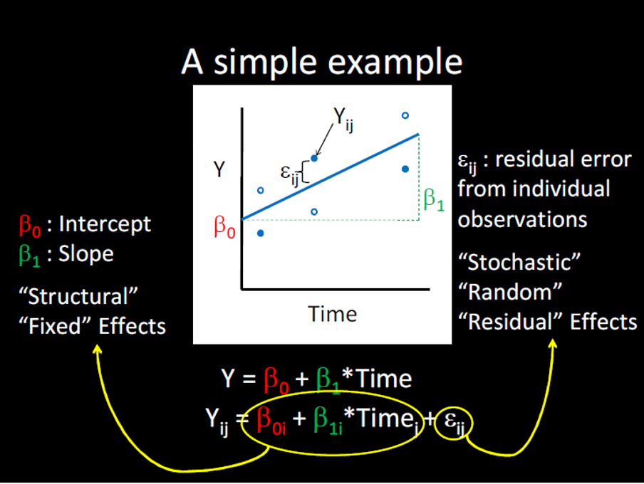 

$$Y_{ij}=\color{red}{\beta_{0i}}+\color{green}{\beta_{1i}}*Time_j+\epsilon_{ij}$$

- Fixed effects: $\color{red}{\beta_{0i}}+\color{green}{\beta_{1i}}*Time_j$
  - Unique intercept() and slope()for each participant
  - Multiple values of Time for each participant
  - Assuming same functional form for each participant
  
- Random effects: $\epsilon_{ij}$
  - Uniquze residual() for each observation(Particpant x Time)
  - Represent measurement error and "unexplained variance"
    - "There are other predictors"
  - Distributional assumptions: residuals drwan from normal distribution with mean 0

How it is on slides:
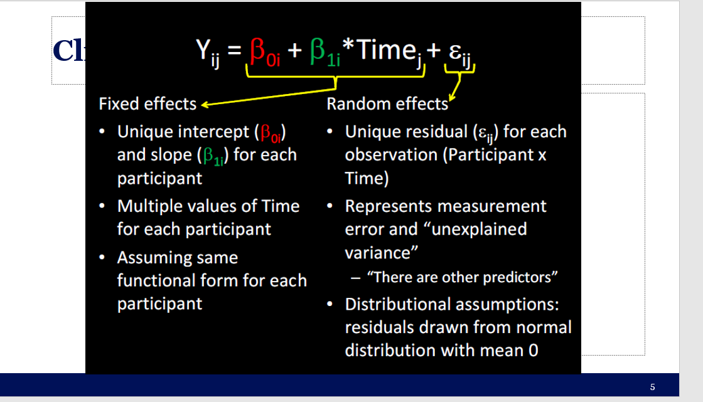


### Process of building growth curve models

- Base model typically only includes (unconditional):
  - Outcome, time and random intercepts for the subjects
- Next step could include adding polynomials for time (unconditional) or it could include adding variable of interest (conditional)
- Next step could be adding an interaction term… and so on.


### Process of building growth curve models

- Comparisons of model fit:
  - Tend to rely on log likelihood (LL)
  - Not very meaningful (unlike an R2)
  - Change in LL indicates improvement of the fit of the model **(higher is better)**
  - -2LL follows a chi square distribution (so we get p-values this way)
  - Can only compare nested models (outcome must remain the same)

- [Check out this for more on LL and maximum likelihood estimation](https://towardsdatascience.com/probability-concepts-explained-maximum-likelihood-estimation-c7b4342fdbb1)


### Exercise: Run a series of growth models

- Install and load the lme4 and lmerTest packages
- Load the ChickWeight data: data(ChickWeight)
- Check out the data set (look at data frame, get a summary)
- Using `lmer()`
- Make and save a base model: weight ~ Time + (1|Chick), REML=F
  - Next: weight ~ Time + Diet + (1|Chick), REML=F
  - Next: weight ~ Time * Diet + (1|Chick), REML=F
- Use `anova()` to compare all three models (you can enter all three at once)
- Generate a summary of the best fitting model and interpret
- Now add the random slopes for Time to the model and compare it to your best fitting model from before


### Loading ChickWeight data data

- Don't forget to include required packages


```{r ex11, exercise=TRUE}
# your code here
```
```{r ex11-hint}

require(lme4)
require(lmerTest)
require(ggplot2)
require(Rcpp)


```


### Check out the data set (look at data frame, get a summary)


```{r ex12, exercise=TRUE}


```
```{r ex12-hint}
data(ChickWeight)
summary(ChickWeight)
```


### Using `lmer()` Make and save a base model

- Model: weight ~ Time + (1|Chick), REML=F
- Next: weight ~ Time + Diet + (1|Chick), REML=F
- Next: weight ~ Time * Diet + (1|Chick), REML=F


```{r ex13, exercise=TRUE}


```
```{r ex13-hint}
m.base <- lmer(weight ~ Time + (1 | Chick), data=ChickWeight, REML=F) #Unconditional Model
m.0 <- lmer(weight ~ Time + Diet + (1 | Chick), data=ChickWeight, REML=F) #Fixed effects
m.1 <- lmer(weight ~ Time * Diet + (1 | Chick), data=ChickWeight, REML=F) #Interaction
```


### Use anova() to compare all three models (you can enter all three at once)


```{r ex14, exercise=TRUE}


```
```{r ex14-hint}
anova(m.base,m.0,m.1)
```


### Generate a summary of the best fitting model and interpret


```{r ex15, exercise=TRUE}


```
```{r ex15-hint}
performance::compare_performance(m.base,m.0,m.1)
plot(performance::compare_performance(m.base,m.0,m.1))
summary(m.1)
```


### Now add the random slopes for Time to the model and compare it to your best fitting model from before

```{r ex16, exercise=TRUE}


```
```{r ex16-hint}
#Attemping to run the model with random intercept and random slope
#Fails to converge
m.t1 <- lmer(weight ~ Time * Diet + (1 + Time| Chick), data=ChickWeight, REML=F)
anova(m.1,m.t1)
summary(m.t1)
```


### Functional form of growth curve

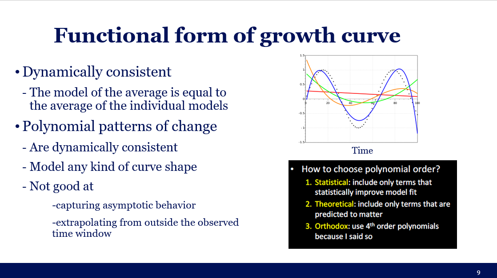 

- Dynamically consistent
  - The model of the average is equal to the average of the individual models
- Polynomial patterns of change
  - Are dynamically consistent
  - Model any kind of curve shape
  - Not good at
	  - capturing asymptotic behavior
	  - extrapolating from outside the observed 	time window

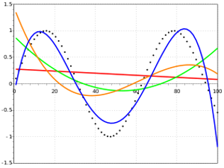


- How to choose polynomial order?
  - **Statistical:** include only terms that statistically improve model fit
  - **Theoretical:** include only terms that are preticted to matter
  - **Orthodox:** Use 4th order polynomials because I said so

## Orthogonal polynomials
  
     
### Natural vs. Orthogonal polynomials

- Natural Polynomials:
  - Correlated time terms
- Orthogonal Polynomials
  - Uncorrelated time terms
 
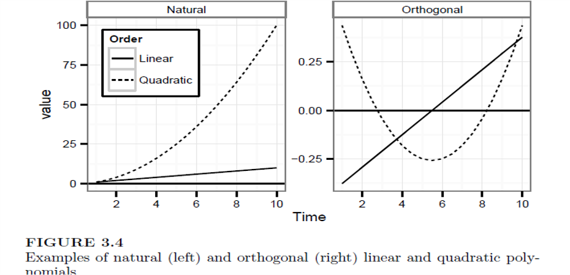 
  
### Interpreting orthogonal polynomial terms  

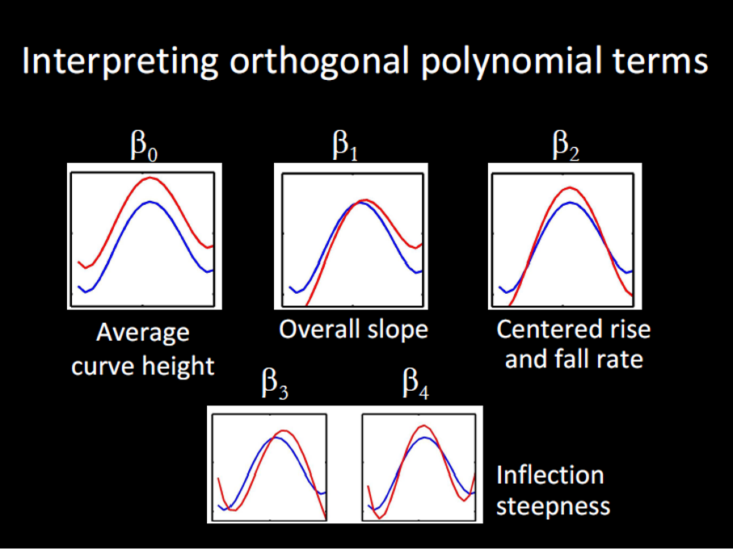

### Examples of orthogonal polynomial terms with different coefficents


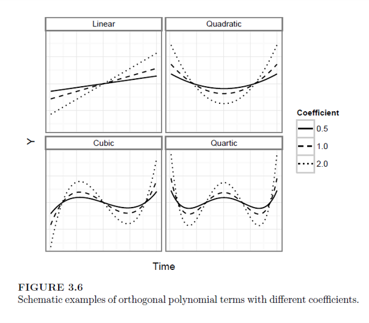


### Specifying random effects

- “Keep it maximal” 
  - When random effects are underspecified in growth models, more variance can get relegated to fixed effects than should be in terms of error.
  - Try to include all possible random effects for the polynomials
  - If model doesn’t converge, simplify the random effect structure (see Mirman, 2014 for ideas)


### Run unconditional growth models model  (VWP)

- [VWP](https://www.jove.com/t/58086/using-eye-movements-recorded-visual-world-paradigm-to-explore-online)

- Load GrowthCurve_Examples.Rdata (open file in R) 
- Using TargetFix data 
  - simple target fixation data (eye tracking) from a VWP experiment with a word frequency manipulation (High frequency words recognized faster than Low frequency words). Condition (High vs. Low frequency)
  - Create orthogonal polynomials using
  - t <- poly((unique(TargetFix$timeBin)), 3)
  - TargetFix[,paste("ot", 1:3, sep="")] <- t[TargetFix$timeBin, 1:3]
- Run a series of unconditional models only using the increasing orthogonal polynomials and see which one fits best)
- Outcome is meanFix
- **Include a random intercept for subject and random slope for each polynomial)**


### Load GrowthCurve_Examples.Rdata 

```{r ex21, exercise=TRUE}
#Require 
```
```{r ex21-hint}

load("GrowthCurve_Examples.Rdata")
```


### Using TargetFix data 

- simple target fixation data (eye tracking) from a VWP experiment with a word frequency manipulation (High frequency words recognized faster than Low frequency words). Condition (High vs. Low frequency)
- Create orthogonal polynomials using
  - t <- poly((unique(TargetFix$timeBin)), 3)
  - TargetFix[,paste("ot", 1:3, sep="")] <- t[TargetFix$timeBin, 1:3]


```{r ex22, exercise=TRUE}
#Require 
```
```{r ex22-hint}
summary(TargetFix)
t <- poly((unique(TargetFix$timeBin)), 3)
TargetFix[,paste("ot", 1:3, sep="")] <- t[TargetFix$timeBin, 1:3]
```

### Run a series of unconditional models only using the increasing orthogonal polynomials and see which one fits best)

- Outcome is meanFix
- **Include a random intercept for subject and random slope for each polynomial)**


```{r ex23, exercise=TRUE}
#Require 
```
```{r ex23-hint}
#Unconditional models
m.base.un <- lmer(meanFix ~ ot1 + (1+ot1| Subject), data=TargetFix, REML=F)
m.base2.un <- lmer(meanFix ~ ot1 + ot2 + (1+ot1 + ot2| Subject), data=TargetFix, REML=F)
m.base3.un <- lmer(meanFix ~ ot1 + ot2 + ot3 + (1 + ot1 + ot2 + ot3| Subject), data=TargetFix, REML=F)
anova(m.base.un,m.base2.un,m.base3.un)
summary(m.base3.un)
```


### Interpreting condition x time effects

$$Y_{ij}={\beta_{0i}}+{\beta_{1i}}*Time_j+\color{red}{\beta_{2i}}Time^2_j+{\beta_{3i}}Time^3_j+{\beta_{4i}}Time^4_j+\epsilon_{ij}$$
$\color{red}{\beta_{2i}}=\color{red}{\gamma_{20}}+\color{green}{\gamma_{2c}}C+\color{blue}{\gamma_{2i}}P_i+?_{2i}$


- $\color{green}{\gamma_{2c}}$ = unique quadratic term for condition C
  - **Relative stepness for condition C**

- $\color{blue}{\gamma_{2i}}$ = unique quadratic term for Participant i
  - **Relative steepness for Participant i**
  
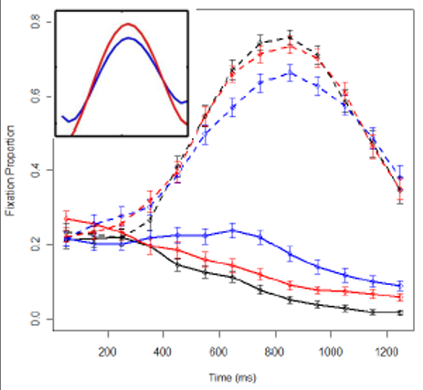


### Exercise: Run conditional growth models model  (VWP)

[VMP](https://www.jove.com/t/58086/using-eye-movements-recorded-visual-world-paradigm-to-explore-online)

- Load GrowthCurve_Examples.Rdata (open file in R) 
- Using TargetFix data 
- Run a full conditional models using all orthogonal polynomials and their interactions with condition
- Specify your random effects like this:  
  - (ot1+ot2+ot3 | Subject) +  (ot1+ot2+ot3 | Subject:Condition)
- Generate the summary of the model and try to interpret it

  
### Run a full conditional models using all orthogonal polynomials and their interactions with condition

- Don't forget to load GrowthCurve_Examples.Rdata
- Specify your random effects like this:  
  - (ot1+ot2+ot3 | Subject) +  (ot1+ot2+ot3 | Subject:Condition)


```{r ex31, exercise=TRUE}


```
```{r ex31-hint}
load("GrowthCurve_Examples.Rdata")
#Run the full conditional model
m.full <- lmer(meanFix ~ (ot1+ot2+ot3)*Condition +
                 (1+ot1+ot2+ot3 | Subject) +
                 (1+ot1+ot2+ot3 | Subject:Condition),
                  data=TargetFix, REML=F)


```

### Generate the summary of the model and try to interpret it

```{r ex32, exercise=TRUE}


```
```{r ex32-hint}
summary(m.full)


#Make a nice graph
ggplot(TargetFix, aes(Time, meanFix, color=Condition)) +
  stat_summary(fun.data=mean_se, geom="pointrange") +
  labs(y="Fixation Proportion", x="Time since word onset (ms)") +
  theme_bw() + scale_color_manual(values=c("red", "blue"))
last_plot() + stat_summary(aes(y=fitted(m.full)), fun.y=mean, geom="line")

```


## Reporting and Graphing

### Reporting results from growth curve analysis

- Growth curve analysis (Mirman, 2014) was used to analyze the target gaze data from 300ms to 1000ms after word onset. The overall time course of target fixations was modeled with a third-order (cubic) orthogonal polynomial and fixed effects of Condition (Low vs. High frequency; within-participants) on all time terms. The model also included participant random effects on all time terms and participant-by-condition random effects on all time terms except the cubic (estimating random effects is “expensive” in terms of the number of observation required, so this cubic term was excluded because it tends to capture less-relevant effects in the tails). There was a significant effect of Condition on the intercept term, indicating lower overall target fixation proportions for the Low condition relative to the High condition (Estimate = -0.058, SE = 0.019, p < 0.01). There was also a significant effect on the quadratic term, indicating shallower curvature - slower word recognition - in the Low condition relative to the High condition (Estimate = 0.16, SE = 0.054, p < 0.01). All other effects of Condition were not significant (see Table 1 for full results).
- Must report form of model
  - Types of polynomials, fixed effects, random effects	
- Main findings
  - Report parameter estimates, standard errors, significance tests
- Include a graph! 

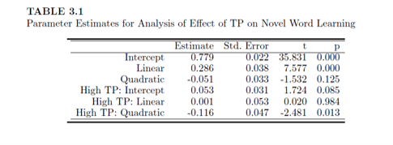

### Graphing results


- ggplot is the best way

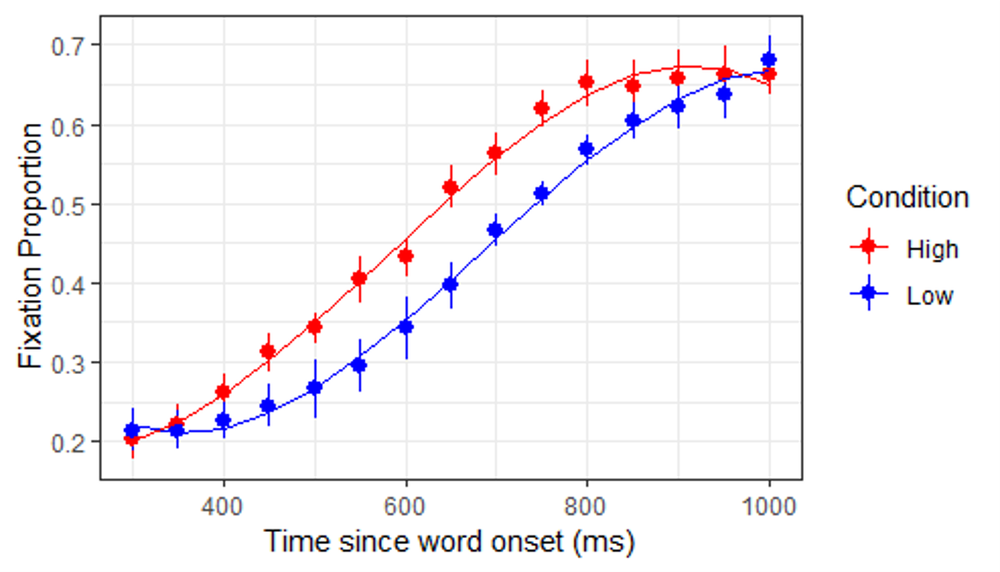
     
     
### An example from my own research


- https://www.sciencedirect.com/science/article/pii/S0003687018301972?via%3Dihub


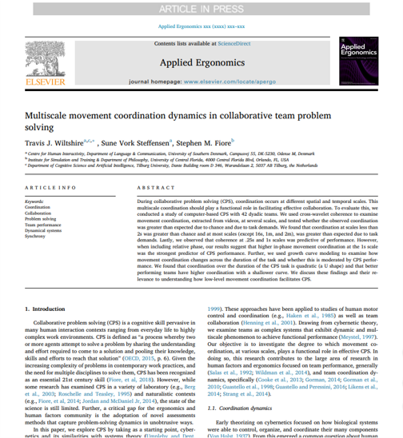
     
     
### Book

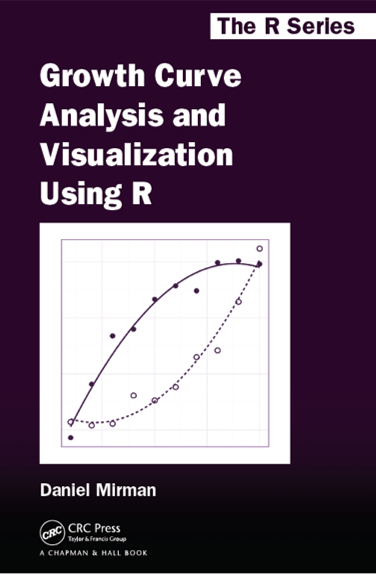
     
## Wrap up     
     
### Statistics Wrap Up


- Statistical decision making isn’t easy
- Model based approaches can be better than mean comparisons
- Beware of misusing p-values or following the null ritual
- Your best guide is to be driven by theory and prior empirical work for developing your research questions/experiments, and then you choose the best statistical tool to answer that (avoid using a tool to guide your RQs). 
- https://lindeloev.github.io/tests-as-linear/


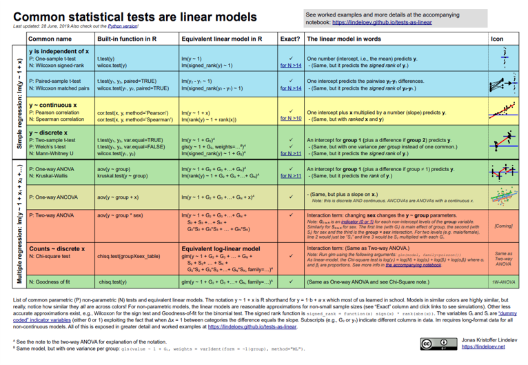


### Future Possibilities

- Research Internships
- Research Assistants  
- Teaching Assistants
- Thesis Supervision 


- **My Research Interests: **
  - Team cognition and dynamics
  - Collaboration
  - Interpersonal coordination
  - Social cognition and interaction
  - Complex and Dynamical systems
  - Quantitative methods
  - Learning and training science

- Check out my papers: https://www.travisjwiltshire.com/publication/

### Thanks!

Good luck consolidating all this knowledge!
**Questions?**
