```{r setup, include=FALSE}
## libraries1
library(learnr)
library(googlesheets4)
library(tidyr)
library(dplyr)
library(ggplot2)
library(scales)
gs4_auth()
g_sheet <- "https://docs.google.com/spreadsheets/d/11yF_gMK87-POZVLrCwLc_E4CB59P7-dzNojLlMUwfxk/edit?usp=sharing"

## options
knitr::opts_chunk$set(echo = FALSE)
tutorial_options(exercise.eval = FALSE)

## recording data
new_recorder <- function(tutorial_id, tutorial_version, user_id, event, data) {
    cat(user_id, ", ", event, ",", data$label, ", ", data$answer, ", ", data$correct, "\n", sep = "", file = "student_progress.txt", append = TRUE)
  

  
g_tibble <- tibble::tibble(
user_id  = user_id, 
event = event,
label = data$label,
correct = data$correct,
question = data$question,
answer = data$answer
  )

# write to google sheets
sheet_append(g_sheet, g_tibble, sheet = 1)

}

options(tutorial.event_recorder = new_recorder)
```

## Introduction


```{r, echo=FALSE, out.width="100%", fig.align = "center"}
knitr::include_graphics("images/banner.png")  
```


### Outline

1. Understand linear regression with one predictor
    - Categorical
2. Meaningful intercepts
3. Assumptions of Regression
4. `Gvlma()`
5. `check_model()` from performance package


## Quiz


### Question 1
```{r Quiz1}
  question("If you observeda-0.03 correlation between hours of daylight and mood, which are you most likely to include?",
    answer("There is a negative relationship between hours of daylight and mood.", correct = TRUE),
    answer("There is a positive relationship between hours of daylight and mood."),
    answer("There is no relationship between hours of daylight and mood."),
    answer("Not enough information is provided"),
    incorrect = "Hint: Try again, you can pick another answer!",
    allow_retry = TRUE
    )
```
### Question 2
```{r Quiz2}
  question("Inaregression equation, b0 describes which of the following? ",
    answer("The x intercept"),
    answer("The regression coefficient of the predictor"),
    answer("The correlation coefficients"),
    answer("The y intercept", correct = TRUE),
    incorrect = "Hint: Try again, you can pick another answer!",
    allow_retry = TRUE
    )
```

### Question 3
```{r Quiz3}
 question("All regression models useastraight line to describe the data. ",
    answer("Yes"),
    answer("No", correct = TRUE),
    incorrect = "Hint: Try again, you can pick another answer!",
    allow_retry = TRUE
    )
```

### Question 4
```{r Quiz4}
question("The slope ofaregression line can be:",
    answer("Positive"),
    answer("Negative"),
    answer("Zero", correct = TRUE),
    answer("Undefined"),
    incorrect = "Hint: Try again, you can pick another answer!",
    allow_retry = TRUE
    )
```

### Question 5
```{r Quiz5}
  question("The R-squared value tells you",
    answer("If there is a relationship between your predictor and your outcome", correct = TRUE),
    answer("How much error is in your model"),
    answer("How much of the variance your overall model accounts for"),
    answer("If your regression summary is valid "),
    incorrect = "Hint: Try again, you can pick another answer!",
    allow_retry = TRUE
    )
```

  
  
## Understanding regression


### Describing a Straight Line

$$Y_i = b_0 +b_iX_i+\epsilon_i$$

- $b_i$
  - Regression coefficient for the predictor
  - Gradient (slope) of the regression line
  - Direction/strength of relationship
- $b_0$
  - Intercept (value of Y when X = 0)
  - Point at which the regression line crosses the Y-axis (ordinate)
### Different types of correlation relationships


     
### Output of a Simple Regression 

- We have created an object called albumSales.1 that contains the results of our analysis. We can show the object by executing:
  - summary(albumSales.1)

>Coefficients:
                   Estimate        Std. Error     t value      Pr(>|t|)    
(Intercept) 1.341e+02   7.537e+00   17.799       <2e-16 ***
adverts       9.612e-02    9.632e-03    9.979         <2e-16 ***

    - Signif. codes:  0 ‘***’ 0.001 ‘**’ 0.01 ‘*’ 0.05 ‘.’ 0.1 ‘ ’ 1 

- Residual standard error: 65.99 on 198 degrees of freedom
- Multiple R-squared: 0.3346, Adjusted R-squared: 0.3313 
- F-statistic: 99.59 on 1 and 198 DF,  p-value: < 2.2e-16

### Making predictions with our Model

$$Record\ Sales_i = b_0+b_1Advertising\ Budget_i\\
=134.14+(0.09612\times Advertising\ Budget_i)$$

$$Record\ Sales_i = 134.14+(0.09612\times Advertising\ Budget_i)\\
=134.14+(0.09612\times 100)\\
=143.75$$


### Regression in Matrix Algebra Form

     
$$\underbrace{\begin{bmatrix}
y_1  \\
y_2  \\
y_3  \\
\end{bmatrix}}_y =\underbrace{ \begin{bmatrix} 1 & x_1  \\ 2 & x_2  \\3 & x_3  \\ \end{bmatrix}}_X\underbrace{\begin{bmatrix} \beta_0  \\ \beta_1  \\ \end{bmatrix}}_\beta+\underbrace{\begin{bmatrix}
e_1  \\
e_2  \\
e_3  \\
\end{bmatrix}}_e=X\beta+e$$

Note that the matrix-vector multiplication $X\beta$ results in:
$$X\beta=\begin{bmatrix}
\beta_0+\beta_1 x_1  \\
\beta_0+\beta_1 x_2  \\
\beta_0+\beta_1 x_3  \\
\end{bmatrix} $$


- More details [here](https://godatadriven.com/blog/the-linear-algebra-behind-linear-regression/)
- And [here](https://online.stat.psu.edu/stat462/node/132/)


### Regression with a Categorical Predictor

pitch = c(233,204,242,130,112,142)  
sex = c(rep("female",3),rep("male",3))  
my.df = data.frame(sex,pitch)  

#model pitch by sex
xmdl = lm(pitch ~ sex, my.df)  
summary(xmdl)  

```{r }
pitch = c(233,204,242,130,112,142)
sex = c(rep("female",3),rep("male",3))
my.df = data.frame(sex,pitch)

#model pitch by sex
xmdl = lm(pitch ~ sex, my.df)
summary(xmdl)
```


### What’s going on with our predictor?

contrasts(my.df$sex)
male
female    0
male      1

mean(my.df[my.df$sex=="female",]$pitch)
**226.3333**

mean(my.df[my.df$sex==“male",]$pitch)
128

Call:
lm(formula = pitch ~ sex, data = my.df)

Residuals:
      1       2       3       4       5       6 
  6.667 -22.333  15.667   2.000 -16.000  14.000 

Coefficients:
            Estimate Std. Error t value Pr(>|t|)    
(Intercept)   **226.33**      10.18  22.224 2.43e-05 ***
sexmale       -98.33      14.40  -6.827  0.00241 ** 
---
Signif. codes:  0 ‘***’ 0.001 ‘**’ 0.01 ‘*’ 0.05 ‘.’ 0.1 ‘ ’ 1

Residual standard error: 17.64 on 4 degrees of freedom
Multiple R-squared:  0.921, Adjusted R-squared:  0.9012 
F-statistic: 46.61 on 1 and 4 DF,  p-value: 0.002407

### Exercise 1: Run a regression on exam anxiety data

- Load the Exam Anxiety.dat file into R.
- Make a prediction about the relationship between exam anxiety and gender
- Run a linear regression using the `lm()` function
- Interpret the output


### 1. Loading Exam Anxiety data

In this online coding environment it’s not needed to load the data, because they are pre-loaded. However, do not forget to load the data and libraries when running R studio on your computer!

```{r ex11, exercise=TRUE}
# your code here
```
```{r ex11-hint}
pitch = c(233,204,242,130,112,142)
sex = as.factor(c(rep("female",3),rep("male",3)))
my.df = data.frame(sex,pitch)
```
```{r ex11-check}
#store
```

### 2. Model pitch by sex

```{r ex12, exercise=TRUE}


```
```{r ex12-hint}
xmdl = lm(pitch ~ sex, my.df)
summary(xmdl)

```
```{r ex12-check}
#store
```

### 3. Check how R is treating the dummy coding of a character variable

```{r ex13, exercise=TRUE}


```
```{r ex13-hint}

contrasts(my.df$sex)
mean(my.df[my.df$sex=="female",]$pitch)
```
```{r ex13-check}
#store
```

### 4. Continous data

```{r ex14, exercise=TRUE}


```
```{r ex14-hint}
age = c(14,23,35,48,52,67)
pitch = c(252,244,240,233,212,204)
my.df = data.frame(age,pitch)
xmdl = lm(pitch ~ age, my.df)
summary(xmdl)

```
```{r ex14-check}
#store
```

### 5. Check with centering


```{r ex15, exercise=TRUE}


```
```{r ex15-hint}
my.df$age.c = my.df$age - mean(my.df$age)
xmdl = lm(pitch ~ age.c, my.df)
summary(xmdl)

```
```{r ex15-check}
#store
```

### 6. Check linearity and homscedasticity


```{r ex16, exercise=TRUE}


```
```{r ex16-hint}
plot(fitted(xmdl),residuals(xmdl), pch=20)
abline(a=0,b=0, lty=2)

#Check normality of residuals
hist(residuals(xmdl))
qqnorm(residuals(xmdl))

#Check for influential data points
dfbeta(xmdl)

# Global Check of the assumptions
require(gvlma)
gvlma(xmdl)

```
```{r ex16-check}
#store
```


### Meaningless intercepts with continuous variables

`age = c(14,23,35,48,52,67)`  
`pitch = c(252,244,240,233,212,204)`  
`my.df = data.frame(age,pitch)`  
`xmdl = lm(pitch ~ age, my.df)`  
`summary(xmdl)`  

```{r }
age = c(14,23,35,48,52,67)
pitch = c(252,244,240,233,212,204)
my.df = data.frame(age,pitch)
xmdl = lm(pitch ~ age, my.df)
summary(xmdl)

```

### Meaningless intercepts

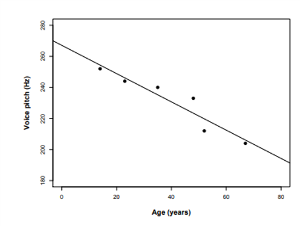
     

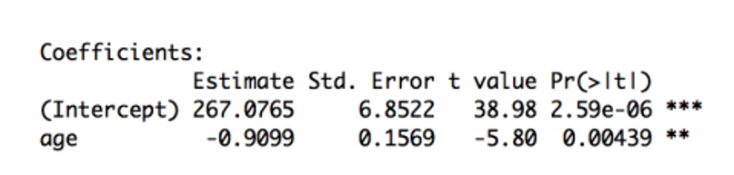

### Using centering to make a more meaningful intercept

`my.df$age.c = my.df$age - mean(my.df$age)`  CENTERING

`xmdl = lm(pitch ~ age.c, my.df)`
`summary(xmdl)`

```{r }
age = c(14,23,35,48,52,67)
pitch = c(252,244,240,233,212,204)
my.df = data.frame(age,pitch)
my.df$age.c = my.df$age - mean(my.df$age) #CENTERING
xmdl = lm(pitch ~ age.c, my.df)
summary(xmdl)


```

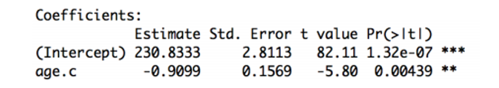

Now our intercept tells us the mean voice pitch. 

## Assumptions of Regression

### Linearity

- Assuming a linear combination of variables to describe our outcome
  - If not, residuals plot will show curves or some other patterns
  
`plot(fitted(xmdl),residuals(xmdl), pch=20)`
`abline(a=0,b=0, lty=2)`

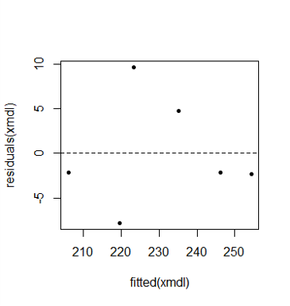

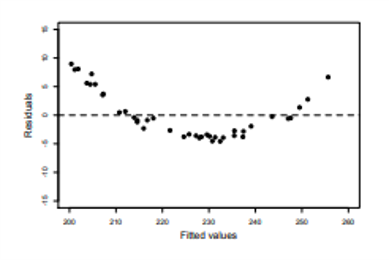
     
### Homoscedasticity

- The variance of the data should be approximately equal across the range of predicted values
- Check the residual plots

**Good / Homoscedastic**

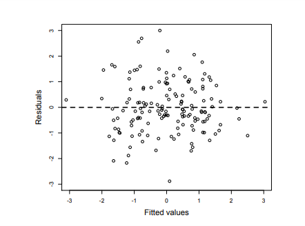

**Less Good**

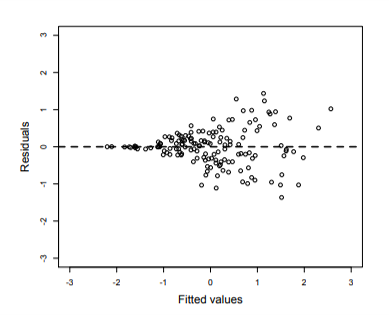
     
### Normality of Residuals     

Examine the histogram or q-q plot of the residuals.

`hist(residuals(xmdl))`
`qqnorm(residuals(xmdl))`

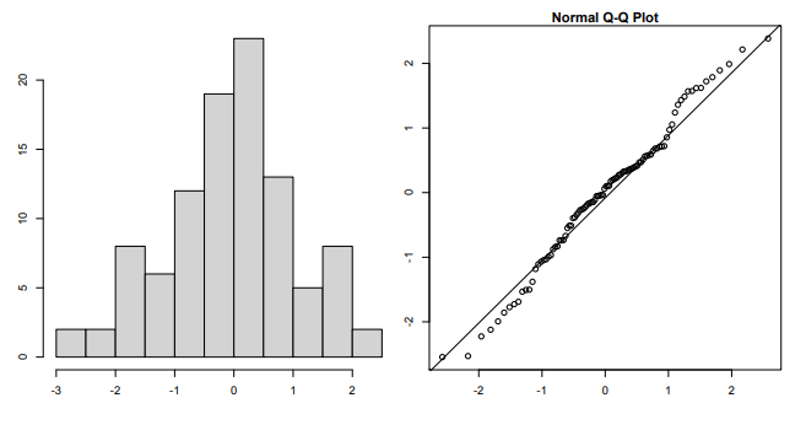

### Be cautious of influential points (outliers)

- `dfbeta(xmdl)`

```{r }

dfbeta(xmdl)

```
- Leave one out diagnostics for each point 
  - Adjustments to the coef if that estimate is left out
- Make sure the values won’t change the sign of the coef
- Half of the absolute value of coef could be concerning 


- What to do if you have these points?
  - Run analyses both ways (with and without) and report
  - Consider why it might be valid to exclude them

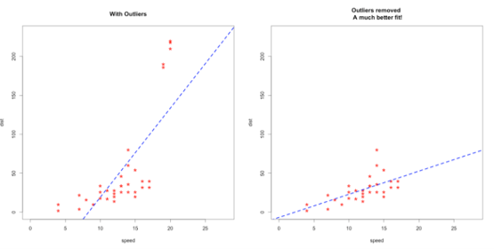
     
### Independence *IMPORTANT!*

- Each observation must be independent 
  - Increased chance of spurious results 
  - Meaningless p-values
- Part of the experimental design
- Use mixed models to resolve non-independencies

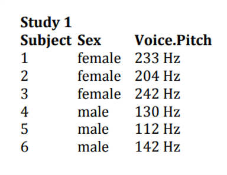 | 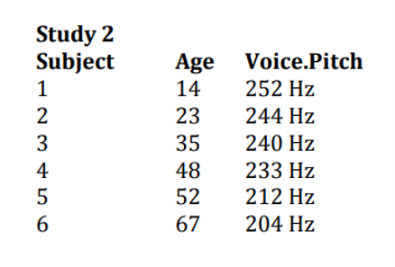

### Exercise 2: Check the assumptions of exam anxiety data

- Load the Exam Anxiety.dat file into R.
- Make a prediction about the relationship between exam anxiety and exam performance
- Run a linear regression using the lm() function
- Check the linearity assumption
- Check the homoscedasticity assumption
- Check the normality of the residuals
- Check for influential data points


### 1. Load exam data

In this online coding environment it’s not needed to load the data, because they are pre-loaded. However, do not forget to load the data and libraries when running R studio on your computer!

```{r ex21, exercise=TRUE}
#Load the data 
```
```{r ex21-hint}
examData<-read.delim(file="Exam Anxiety.dat",header=TRUE)
mod1<-lm(Anxiety~Gender,data=examData)
summary(mod1)
```
```{r ex21-check}
#store
```


### 2. Create a linear regression model

```{r ex22, exercise=TRUE}
#Load the data 
```
```{r ex22-hint}
mod1<-lm(examData$Exam~examData$Anxiety)
```
```{r ex22-check}
#store
```


### 3. Check linearity and homscedasticity

```{r ex23, exercise=TRUE}
#Load the data 
```
```{r ex23-hint}
plot(fitted(mod1),residuals(mod1), pch=20)
abline(a=0,b=0, lty=2)
```
```{r ex23-check}
#store
```


### 4. Check normality of residuals

```{r ex24, exercise=TRUE}
#Load the data 
```
```{r ex24-hint}
hist(residuals(mod1))
qqnorm(residuals(mod1))
```
```{r ex24-check}
#store
```


### 5. Check for influential data points

```{r ex25, exercise=TRUE}
#Load the data 
```
```{r ex25-hint}
dfbeta(mod1)

```
```{r ex25-check}
#store
```


### 6. Check for global satisfaction of assumptions

```{r ex26, exercise=TRUE}
#Load the data 
```
```{r ex26-hint}
gvlma(mod1)
```
```{r ex26-check}
#store
```


### gvlma()  - a global check of regression assumptions

`gvlma(xmdl)`

```{r }
library(gvlma)

gvlma(xmdl)

```


**Combine both methods ! **

Original paper [here](https://www.ncbi.nlm.nih.gov/pmc/articles/PMC2820257/)


### Link Function

- Is your dependent variable truly continuous, or is it maybe more categorical? 
  - Model could be mis-specified 
  - Rejection of the null (p < .05) or failure of this assumption indicates that you should considering use an alternative form of the generalized linear model (e.g., logistic or binomial regression).

### Exercise: Check the assumptions of exam anxiety data with gvlma()

- Try `gvlma()` on the exam anxiety model 
  - Don’t forget to install and load the gvlma package
- Use `check_model()` from performance package on model
- Compare it with the conclusions you made from checking the graphs


### Running another model and checking the assumptions

- Use the driving data with `read.csv()`
- Run two models
	- Age as predictor of errors at time2
  - Gender as a predictor of errors at time2
- Interpret the output
- For age, generate a meaningful intercept
- Check the assumptions of both models
- Write a summary of the results


### 1. Running another model

In this online coding environment it’s not needed to load the data, because they are pre-loaded. However, do not forget to load the data and libraries when running R studio on your computer!

```{r ex31, exercise=TRUE}
#Load the data 
```
```{r ex31-hint}
driving <- read.csv("driving.csv")

dmod1<- lm(errors_time2~age,data=driving)
dmod2<- lm(errors_time2~gender,data=driving)

summary(dmod1)
summary(dmod2)

```
```{r ex31-check}
#store
```


### 2. Create a centered age variable and re-run the model

```{r ex32, exercise=TRUE}
#Create new variable in dataframe
```
```{r ex32-hint}
driving$age.c<- driving$age-mean(driving$age)
dmod1c<-lm(errors_time2~age.c,data=driving)
summary(dmod1c)

```
```{r ex32-check}
#store
```


### 3. Do a global check of all the models

```{r ex33, exercise=TRUE}
#Load the data 
```
```{r ex33-hint}
gvlma(dmod1)
gvlma(dmod2)
gvlma(dmod1c)

```
```{r ex33-check}
#store
```


### 4. Use performance from easy stats

```{r ex34, exercise=TRUE}
#Load the data 
```
```{r ex34-hint}
require(performance)
check_model(dmod1)

```
```{r ex34-check}
#store
```


### check_model() from performance package

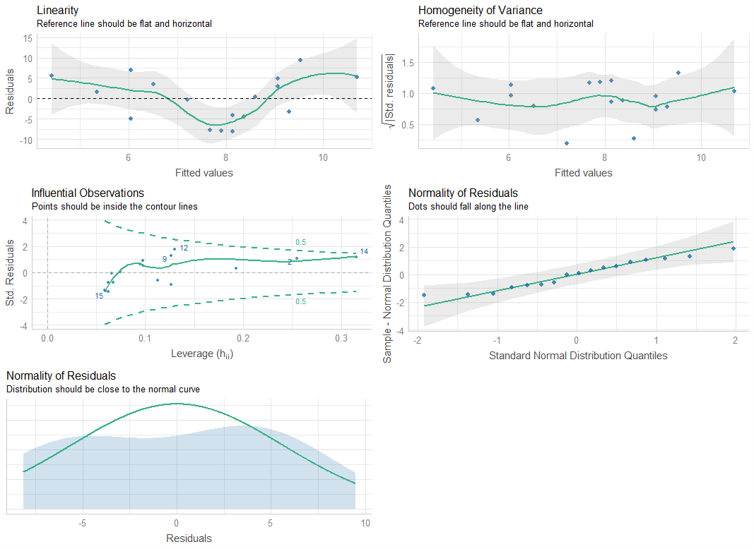

## Conclusion 

### Summing Up

- Understand linear regression with one predictor
  - Categorical
- Meaningful intercepts
- Assumptions of Regression
- gvlma 
- `check_model()` from performance package

### Thanks!

See you next week!
**Questions?**
