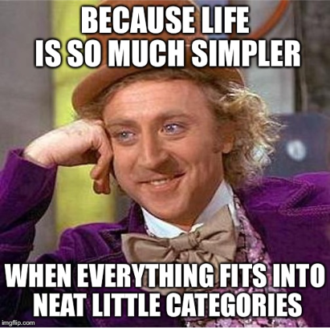
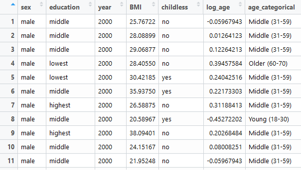
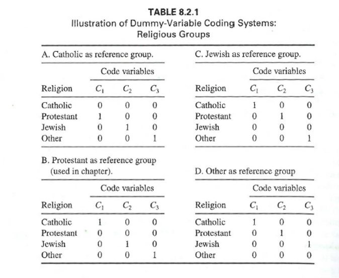
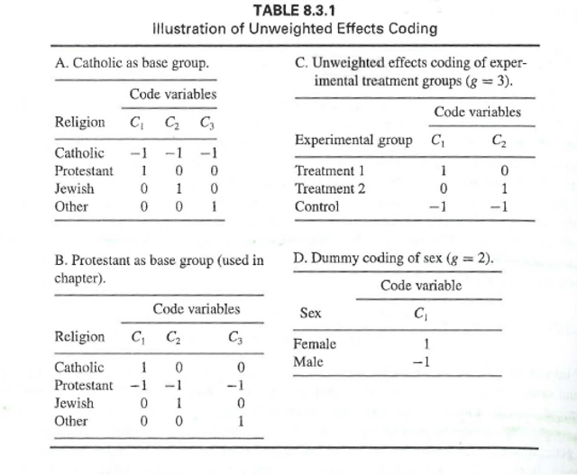
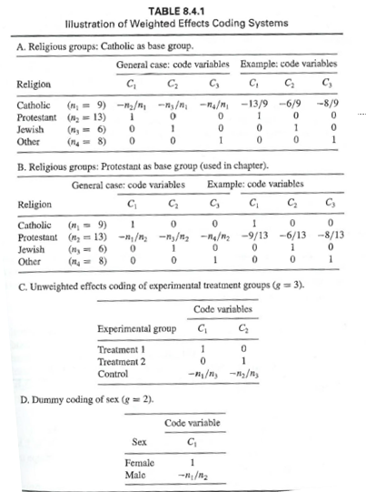
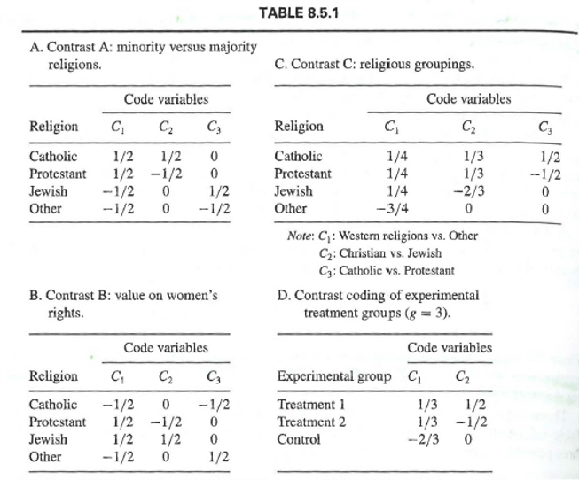

```{r setup, include=FALSE}
## libraries1
library(learnr)
library(googlesheets4)
library(tidyr)
library(dplyr)
library(ggplot2)
library(scales)
gs4_auth()
g_sheet <- "https://docs.google.com/spreadsheets/d/11yF_gMK87-POZVLrCwLc_E4CB59P7-dzNojLlMUwfxk/edit?usp=sharing"

## options
knitr::opts_chunk$set(echo = TRUE)
tutorial_options(exercise.eval = FALSE)

## recording data
new_recorder <- function(tutorial_id, tutorial_version, user_id, event, data) {
    cat(user_id, ", ", event, ",", data$label, ", ", data$answer, ", ", data$correct, "\n", sep = "", file = "student_progress.txt", append = TRUE)
  

  
g_tibble <- tibble::tibble(
user_id  = user_id, 
event = event,
label = data$label,
correct = data$correct,
question = data$question,
answer = data$answer
  )

# write to google sheets
sheet_append(g_sheet, g_tibble, sheet = 1)

}

options(tutorial.event_recorder = new_recorder)
```

## 1. Introduction


```{r, echo=FALSE, out.width="100%", fig.align = "center"}
## HEADER ###
HTML("  <div class='jumbotron jumbotron-fluid'>
    <div class='container'>
    <h2 class='mb-3' style='color:rgba(31, 56, 100, 0.85);'><u>Coding and Effects</u></h2>
    <h4 class='mb-3'>Statistics for CSAI II</h4>
    <h6 class='mb-3'>Travis J. Wiltshire, Ph.D.</h6>
    </div>
  </div>")
```


### Outline

1. Multiple Regression 
2. Dummy Coding
3. Unweighted Effects
4. Weighted Effects 
5. Contrast Coding


## Multiple Regression

### Simple vs. Multiple Regression


**Simple**

$$Y_i=b_0+b_iX_i+\epsilon_i$$

- One dependent variable Y predicted from one independent variable X
- One regression coefficient
- $R^2:$ proportion of variation in dependent variable Y predictable from X


**Multiple**

$$Y_i=b_0+b_1X_2+b_2X_2+ ...+b_nX_n+\epsilon_i$$
- One dependent variable Y predicted from **a set of** independent variables ($X_1, X_2, …X_k$)
- One regression coefficient for each independent variable
- $R^2:$ proportion of variation in dependent variable Y predictable by <u>**set of**</u> independent variables (X’s)

### When do we need to think about categories for regression analysis?

- We have nominal/ordinal predictor variables 
- There are 2 or more groups/categories for our predictors



### Coding Systems in Multiple Regression

- All coding systems use g-1 predictor variables to represent all g (groups).
- Each represents a single distinction among the groups
- All groups are:
  - Mutually exclusive
  - Exhaustive



## Dummy coding

### Dummy coding

- Need to carefully consider the reference group
  - A useful comparison (e.g., control group)
  - Size of group should not be too small compared to size of other groups
  - Standardized coefficients are not very useful
- The intercept of the reference group is the mean of the reference group
- Each regression coefficient is a **comparison of the mean of the group to the mean of the reference group. **





## Exercises


### Preparing some data to run a model with dummy codes

- Install and load the ‘wec’ package
- Load the ‘BMI’ data that is within that package (and check out the variables)
- Check out the `dummy.code()` function from the psych package 
- Create a set of dummy coded variables for the education variable in the BMI data set
- Get some descriptive statistics on the data set


### Install and load BMI data

In this online coding environment it’s not needed to load the data, because they are pre-loaded. However, do not forget to load the data and libraries when running R studio on your computer!

```{r ex11, exercise=TRUE}


```
```{r ex11-hint}
#
require(wec)
require(gvlma)
data(BMI)
options(scipen=999)
```
```{r ex11-check}
#store
```

### Create a set of dummy coded variables for the education variable in the BMI data set and get some descriptive data

```{r ex12, exercise=TRUE}
# Dummy coding

```
```{r ex12-hint}
#
dum<-psych::dummy.code(BMI$education)
bmi_ed<-data.frame(BMI,dum)
summary(bmi_ed)
```
```{r ex12-check}
#store
```

### Run multiple regression on the data

- Create a linear model with your dummy codes as predictors of BMI (be sure to choose a referent group)
- Check out and interpret the summary of the model
- Do a global and visual check of the assumptions for the model

### Create a linear model with your dummy codes as predictors of BMI (be sure to choose a referent group)


```{r ex13, exercise=TRUE}


```
```{r ex13-hint}
# Predict BMI from using 'medium' education as the referent group
mod.1<-lm(BMI~lowest + highest, data=bmi_ed)
summary(mod.1)
gvlma(mod.1)
performance::check_model(mod.1)


```
```{r ex13-check}
#store
```

## (unweighted) Effects Coding

### (unweighted) Effects Coding

- Used to compare how the outcome for each group differs from the average outcome of the whole sample (grand mean)
- Base group gets all -1
  - Group that is of least interest
- Regression coefs represent the deviation of the outcome for each separate group to the mean of the sample
- Mean difference for base group: $M = - B_1 – B_2 – B_3…B_i + B_0$



### Exercise: Run a model with unweighted effects codes

- Try out the `contr.sum()` function to generate effects coding matrices for variables with 3 and 4 groups
- Run a linear model with:
  - BMI as the outcome,
  - Education as the predictor
  - Figure out how to use the contrasts argument of `lm()` by creating a list that includes the `contr.sum` for the education variable
- Generate and interpret the summary
- Get the mean of the base group

- Bonus: Figure out the difference between ANOVA and categorical regression


### Use contr.sum() to generate...

- Check out and interpret the summary of the model

```{r ex21, exercise=TRUE}


```
```{r ex21-hint}
#Unweighted effects coding
contrasts(BMI$education)<-contr.sum(3)#use this to check out the contrast matrix
contr.sum(3)
contr.sum(4)

```
```{r ex21-check}
#store
```

### Predict BMI from education using unweighted effects coding 

- Check out and interpret the summary of the model

```{r ex22, exercise=TRUE}


```
```{r ex22-hint}
#
mod.2<-lm(BMI~education, data=BMI,contrasts=list(education=contr.sum))
mod.2<-lm(BMI~education, data=BMI)
summary(mod.2)


```
```{r ex22-check}
#store
```

### Get the mean of the base group


```{r ex23, exercise=TRUE}


```
```{r ex23-hint}
# Print out group means
aggregate(x = BMI$BMI, by = list(BMI$education), FUN = mean)   #Get group means

# Calculate grand mean (mean of means)
(26.14770 + 24.97839 + 24.29695)/3

# Calculate the mean of the base group
-1.00669-(-.16262)+25.14101 #Base group mean

```
```{r ex23-check}
#store
```

### Bonus: Figure out the difference between ANOVA and categorical regression

```{r ex24, exercise=TRUE}


```
```{r ex24-hint}
# Compare results with anova model
anova.results<-aov(BMI ~ education, data= bmi_ed)
summary(anova.results)
psych::describeBy(bmi_ed,group='education')
TukeyHSD(anova.results)
```
```{r ex24-check}
#store
```


## Weighted Effects Coding

### Weighted Effects Coding

- Useful when the proportion of cases from each group ‘represents’ the population
  - (e.g., ethnic makeup, cognitive ability, etc.)
- Or when sample size of groups is different
 


### Exercise: Run a model with weighted effects codes

- Make a weighted contrast matrix using the `contr.wec()` function from wec package
- Make two new variables the represent contrasts either omitting the ‘lowest’ or highest’ education group
- Now run two models including those new variables
- Generate summaries, interpret, and compare


### Make a weighted contrast matrix using the `contr.wec()` function from wec package

```{r ex31, exercise=TRUE}


```
```{r ex31-hint}
#

```
```{r ex31-check}
#store
```

### Make two new variables the represent contrasts either omitting the ‘lowest’ or highest’ education group

```{r ex32, exercise=TRUE}


```
```{r ex32-hint}
wec::contr.wec(BMI$education, omitted='highest')
BMI$educ.wec.lowest <- BMI$educ.wec.highest <- BMI$education


```
```{r ex32-check}
#store
```

### Now run two models including those new variables, interpret and compare


```{r ex33, exercise=TRUE}


```
```{r ex33-hint}
model.wec.lowest <- lm(BMI ~ educ.wec.lowest, data=BMI)
model.wec.highest <- lm(BMI ~ educ.wec.highest, data=BMI)
summary(model.wec.lowest)
summary(model.wec.highest)
mean(bmi_ed$BMI) #See the intercept is the sample mean
mean(BMI$BMI)

```
```{r ex33-check}
#store
```

## Contrast Coding

### Contrast Coding 

- When there are mean expected differences between groups or combinations of groups
- Good for testing specific hypotheses 
  - E.g., group a + b will be less than group c
- Can increase power of the statistical analysis
- **Rules**
  1. Sum of weights across all groups must equal 0
  2. Sum of the products of each pair of code variables must equal 0
  3. Difference between positive set of weights and negative set should equal 1



### Exercise: Run a model with contrast codes

- Create a matrix that allows you to compare the lowest education to the middle and highest matrix (hint: see Table 8.5.1 D)
- Run the model including this matrix in the contrasts arguments
- Generate and interpret the summary


### Create a matrix that allows you to compare the lowest education to the middle and highest matrix (hint: see Table 8.5.1 D)

```{r ex41, exercise=TRUE}


```
```{r ex41-hint}
mat = matrix(c(-2/3,1/3,1/3,0,1/2,-1/2), ncol = 2)# Set the

```
```{r ex41-check}
#store
```

### Run the model including this matrix in the contrasts arguments

```{r ex42, exercise=TRUE}


```
```{r ex42-hint}
mod.3<-lm(BMI~education,contrasts=list(education=mat),data=BMI)

```
```{r ex42-check}
#store
```

### Generate and interpret the summary

```{r ex43, exercise=TRUE}


```
```{r ex43-hint}
summary(mod.3)

```
```{r ex43-check}
#store
```


## Conculsion

### More coding systems

- There are many more types of coding systems:
- https://stats.idre.ucla.edu/r/library/r-library-contrast-coding-systems-for-categorical-variables/#User

- Next week:
  -Polynomial regression


### Thanks!

See you next week!
**Questions?**


