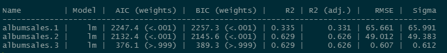

```{r setup, include=FALSE}
## libraries
library(learnr)
library(tidyr)
library(dplyr)

## options
knitr::opts_chunk$set(echo = TRUE)
tutorial_options(exercise.eval = FALSE, exercise.checker=FALSE)


```


## Module one quiz

### Question 1
```{r Quiz2,  echo=FALSE}
  question("What is the common goal of doing empirical work utilizing statistics in CSAI?",
    answer("Become famous"),
    answer("Earn a degree"),
    answer("Use knowledge of sample to make inference", correct = TRUE),
    incorrect = "Hint: Try again, you can pick another answer!",
    allow_retry = TRUE
    )
```


## Module two quiz 

### Question 1

```{r Quiz1,  echo=FALSE}
question("What type of sampling is most commonly used in university settings?",
    answer("Snowball", correct = TRUE),
    answer("Convenience"),
    answer("Random"),
    answer("Volunteer"),
    answer("Opportunity"),
    incorrect = "Hint: Try again, you can pick another answer!",
    allow_retry = TRUE
    )
```


### Question 2

```{r Quiz3,  echo=FALSE}
 question("We use sample statistics to do which of the following regarding population parameters? ",
    answer("Prove"),
    answer("Guess"),
    answer("Differentiate"),
    answer("Estimate", correct = TRUE),
    incorrect = "Hint: Try again, you can pick another answer!",
    allow_retry = TRUE
    )
```

### Question 3

```{r Quiz4,  echo=FALSE}
question("As we increase the sample size, the sampling distribution of the mean becomes:",
    answer("More normal"),
    answer("Wider"),
    answer("Narrower", correct = TRUE),
    answer("Skewed"),
    incorrect = "Hint: Try again, you can pick another answer!",
    allow_retry = TRUE
    )
```

### Question 4

```{r Quiz5,  echo=FALSE}
  question("If I replicate a study 20 times, how many studies will have a mean not included in the 95% CI?",
    answer("1", correct = TRUE),
    answer("2"),
    answer("5"),
    answer("95"),
    incorrect = "Hint: Try again, you can pick another answer!",
    allow_retry = TRUE
    )
```

## Module three quiz

### Question 1
```{r Quiz03_1,  echo=FALSE}
  question("Which function can we use to calculate the effect size when comparing two means?",
    answer("`z.test()`"),
    answer("`t.test()`"),
    answer("`cohen.d()`", correct = TRUE),
    answer("`cov()`"),
    allow_retry = FALSE
    )
```

### Question 2
```{r Quiz03_2,  echo=FALSE}
  question("If the following code `cor.test(exercise_frequency,lifespan, method='pearson',alternative = 'greater')` returns a significant p value, what can we assume about the relationship between exercise frequency and lifespan?",
    answer("Exercising more often causes longer lifespans."),
    answer("Exercising is positively correlated with longer lifespans.", correct =TRUE ),
    answer("Exercising infrequently reduces lifespan."),
    answer("There is a correlation between exercise frequency and lifespan.", correct =TRUE),
    allow_retry = FALSE
    )
```

## Module four quiz

### Question 1

```{r Quiz2_1,  echo=FALSE}
question("How do you estimate the amount of overlap in variance between two variables using the correlation $(r)$?",
    answer("Divide it by 2"),
    answer("Square it", correct = TRUE),
    answer("Take the square root"),
    answer("Divide by standard error"),
    incorrect = "Hint: Try again, you can pick another answer!",
    allow_retry = TRUE
    )
```


### Question 2

```{r Quiz2_2,  echo=FALSE}
  question("An estimate of the correlation between Scoville Heat Units in various chili peppers and perceived pain is $.7$. What size effect is this?",
    answer("Small"),
    answer("Medium"),
    answer("Large", correct = TRUE),
    answer("No idea"),
    incorrect = "Hint: Try again, you can pick another answer!",
    allow_retry = TRUE
    )
```


### Question 3

```{r Quiz2_3,  echo=FALSE}
 question("The null hypothesis for a correlation test is which of the following?",
    answer("The correlation is positive"),
    answer("The correlation is negative"),
    answer("The correlation is different than 0"),
    answer("The correlation is equal to 0", correct = TRUE),
    incorrect = "Hint: Try again, you can pick another answer!",
    allow_retry = TRUE
    )
```

### Question 4

```{r Quiz2_4,  echo=FALSE}
question("How glad are you to have the option to attend lectures on campus?",
    answer("1"),
    answer("2"),
    answer("3"),
    answer("4"),
    answer("5"),
    answer("6"),
    answer("7"),
    answer("8"),
    answer("9"),
    answer("10", correct = TRUE),
    correct = "Answer saved",
    incorrect = "Answer saved",
    allow_retry = FALSE
    )
```


## Module five quiz

### Question 1

```{r Quiz5_1,  echo=FALSE}
question("Which of the following types of correlation would you use if you want to examine the relationship between $x$ and $y$, while controlling for the relationship of $z$ on both $x$ and $y$?",
    answer("Pearson correlation"),
    answer("Partial correlation", correct = TRUE),
    answer("Spearman correlation"),
    answer("Semi-partial correlation"),
    incorrect = "Hint: Try again, you can pick another answer!",
    allow_retry = TRUE
    )
```


### Question 2

```{r Quiz5_2,  echo=FALSE}
  question("What correlation would be most appropriate for examining the relationship between ranking in a gaming competition and age, when the sample size is small?",
    answer("Pearson correlation"),
    answer("Spearman correlation"),
    answer("Kendall's Tau", correct = TRUE),
    answer("Semi-partial correlation"),
    incorrect = "Hint: Try again, you can pick another answer!",
    allow_retry = TRUE
    )
```


### Question 3

```{r Quiz5_3,  echo=FALSE}
 question("Which letter is always used to specify the outcome variable in linear regression models?",
    answer("b"),
    answer("beta"),
    answer("x"),
    answer("y", correct = TRUE),
    incorrect = "Hint: Try again, you can pick another answer!",
    allow_retry = TRUE
    )
```


### Question 1

```{r Quiz3_1,  echo=FALSE}
question("If you observed a $-0.03$ correlation between hours of daylight and mood, which are you most likely to conclude?",
    answer("There is a negative relationship between hours of daylight and mood."),
    answer("There is a positive relationship between hours of daylight and mood."),
    answer("There is no relationship between hours of daylight and mood.", correct = TRUE),
    answer("Not enough information is provided"),
    incorrect = "Hint: Try again, you can pick another answer!",
    allow_retry = TRUE
    )
```


### Question 2

```{r Quiz3_2,  echo=FALSE}
  question("In a regression equation, $b0$ describes which of the following?",
    answer("The x intercept"),
    answer("The regression coefficient of the predictor"),
    answer("The correlation coefficients"),
    answer("The y intercept" , correct = TRUE),
    incorrect = "Hint: Try again, you can pick another answer!",
    allow_retry = TRUE
    )
```


### Question 3

```{r Quiz3_3,  echo=FALSE}
 question("All regression models use a straight line to describe the data.",
    answer("Yes"),
    answer("No", correct = TRUE),
    incorrect = "Hint: Try again, you can pick another answer!",
    allow_retry = TRUE
    )
```


### Question 4

```{r Quiz3_4,  echo=FALSE}
 question("The $R^2$ value tells you",
    answer("If there is a relationship between your predictor and your outcome"),
    answer("How much error is in your model"),
    answer("How much of the variance your overall model accounts for", correct = TRUE),
    answer("If your regression summary is valid"),
    incorrect = "Hint: Try again, you can pick another answer!",
    allow_retry = TRUE
    )
```

### Question 5

```{r Quiz3_5,  echo=FALSE}
 question("The slope of a regression line can be:",
    answer("Positive", correct = TRUE),
    answer("Negative", correct = TRUE),
    answer("Zero", correct = TRUE),
    answer("Undefined", correct = TRUE),
    incorrect = "Hint: Try again, you can pick another answer!",
    allow_retry = TRUE
    )
```

## Module six quiz

### Question 1
```{r Quiz6_1, echo=FALSE}
  question("If you observed a-0.03 correlation between hours of daylight and mood, which are you most likely to include?",
    answer("There is a negative relationship between hours of daylight and mood."),
    answer("There is a positive relationship between hours of daylight and mood."),
    answer("There is no relationship between hours of daylight and mood."),
    answer("Not enough information is provided", correct = TRUE),
    incorrect = "Hint: Try again, you can pick another answer!",
    allow_retry = TRUE
    )
```

### Question 2
```{r Quiz6_2, echo=FALSE}
  question("In a regression equation, b0 describes which of the following?",
    answer("The x intercept"),
    answer("The regression coefficient of the predictor"),
    answer("The correlation coefficients"),
    answer("The y intercept", correct = TRUE),
    incorrect = "Hint: Try again, you can pick another answer!",
    allow_retry = TRUE
    )
```


### Question 3
```{r Quiz6_3, echo=FALSE}
 question("All regression models use a straight line to describe the data.",
    answer("Yes", correct = TRUE),
    answer("No", correct = TRUE),
    incorrect = "Hint: Try again, you can pick another answer!",
    allow_retry = TRUE
    )
```


### Question 4
```{r Quiz6_4, echo=FALSE}
question("The slope of a regression line can be:",
    answer("Positive", correct = TRUE),
    answer("Negative", correct = TRUE),
    answer("Zero", correct = TRUE),
    answer("Undefined", correct = TRUE),
    incorrect = "Hint: Try again, you can pick another answer!",
    allow_retry = TRUE
    )
```


### Question 5

```{r Quiz6_5, echo=FALSE}
  question("The R-squared value tells you",
    answer("If there is a relationship between your predictor and your outcome"),
    answer("How much error is in your model"),
    answer("How much of the variance your overall model accounts for", correct = TRUE),
    answer("If your regression summary is valid "),
    incorrect = "Hint: Try again, you can pick another answer!",
    allow_retry = TRUE
    )
```


## Module seven quiz

### Question 1

```{r Quiz4_1,  echo=FALSE}
question("When performing regression with a dummy coded categorical variable, the output for the $b$ coefficient is always relative to which of the following?",
    answer("Intercept"),
    answer("Values of x"),
    answer("Values of y"),
    answer("The referent category", correct = TRUE),
    incorrect = "Hint: Try again, you can pick another answer!",
    allow_retry = TRUE
    )
```


### Question 2
```{r Quiz4_2,  echo=FALSE}
  question("Which of the following are assumptions of simple linear regression?",
    answer("Heteroscedasticity"),
    answer("Homoscedasticity", correct = TRUE),
    answer("Normality of residuals", correct = TRUE),
    answer("Linear relation between predictor and outcome" , correct = TRUE),
    incorrect = "Hint: Try again, you can pick another answer!",
    allow_retry = TRUE
    )
```

### Question 3

```{r Quiz4_3,  echo=FALSE}
 question("In multiple regression, what is it called when two predictor variables may be highly correlated",
    answer("Redundant"),
    answer("Biased"),
    answer("Collinearity", correct = TRUE),
    answer("Partial regression coefficients"),
    incorrect = "Hint: Try again, you can pick another answer!",
    allow_retry = TRUE
    )
```


## Module eight quiz
### Question 1
```{r Quiz8_1,  echo=FALSE}
  question("How would you create a linear model predicting profit from selling a product from the amount of money spent on marketing that product? Assume the dataset is called 'df' and has two columns: 'profit' and 'marketing'.",
    answer("`lm(marketing~profit,data=df)`"),
    answer("`lm(marketing*profit,data=df)`"),
    answer("`lm(profit+marketing,data=df)`"),
    answer("`lm(profit~marketing,data=df)`", correct = TRUE),
    allow_retry = FALSE
    )
```

### Question 2

{#id .class width=100%}

```{r Quiz8_2,  echo=FALSE}
  question("Given the code output seen above, which model has the best fit?",
    answer("albumsales.1"),
    answer("albumsales.2"),
    answer("albumsales.3", correct = TRUE),
    allow_retry = FALSE
    )
```


### Question 3
```{r Quiz8_3,  echo=FALSE}
  question("Given three models with the following AIC scores: A) 258.96, B) 257.24, C) 501.61, which model would you choose?",
    answer("A"),
    answer("B", correct = TRUE),
    answer("C"),
    allow_retry = FALSE
    )
```


## Module nine quiz
### Question 1
```{r Quiz9_1,  echo=FALSE}
  question("Which of the following functions can help us investigate interactions between variables?",
    answer("`emmeans::emtrends()`", correct = TRUE),
    answer("`rockchalk::plotSlopes()`", correct = TRUE),
    answer("`performance::check_model()`"),
    answer("`interactions::interact_plot()`", correct = TRUE),
    allow_retry = FALSE
    )
```


### Question 2
```{r Quiz9_2,  echo=FALSE}
  question("Which of these equations includes an interaction?",
    answer("$$Y_i=b_0+b_1X_2+b_2X_2+ ...+b_nX_n+\\epsilon_i$$"),
    answer("$$Y_i=b_0+b_1X_2+b_2X_2+b_3X_1X_2+\\epsilon_i$$", correct = TRUE),
    answer("$$Y_i=b_0+b_iX_i+\\epsilon_i$$"),
    allow_retry = FALSE
    )
```


## Module ten quiz
### Question 1
```{r Quiz10,  echo=FALSE}
  question("Which of the following would be a good coding system to use for categorical regression when you want to ensure your sample reflects the distribution of a group in the population?",
    answer("Dummy coding"),
    answer("Unweighted effects"),
    answer("Contrast coding"),
    answer("Weighted effects", correct = TRUE),
    allow_retry = FALSE
    )
```


## Module eleven quiz
### Question 1
```{r Quiz11_1,  echo=FALSE}
  question("Which of the following models shows polynomial regression?",
    answer("`lm(affect ~ stress + performance)`"),
    answer("`lm(affect ~ stress * performance)`"),
    answer("`lm(affect ~ stress + performance + stress$^2$)`", correct = TRUE),
    answer("`lm(affect ~ stress:performance)`"),
    allow_retry = FALSE
    )
```

### Question 2
```{r Quiz11_2,  echo=FALSE}
  question("Which of the following orders of polynomial regression should be used when you want to test for a cubic relationship between affect and stress?",
    answer("First"),
    answer("Second"),
    answer("Third"),
    answer("All of the above", correct = TRUE),
    allow_retry = FALSE
    )
```


### Question 3
```{r Quiz11_3,  echo=FALSE}
  question("Which of the following is TRUE about mixed models?",
    answer("They allow us to model interdendence in our data.", correct = TRUE),
    answer("They do not assume normality of residuals."),
    answer("Mixed models can be compared with F-tests."),
    answer("Mixed models require that intercepts and slopes vary for all random effects."),
    allow_retry = FALSE
    )
```

## Module twelve quiz

### Question 1
```{r Quiz12_1,  echo=FALSE}
  question("Which of the following models shows orthogonal polynomial regression with a quadratic term?",
    answer("`lm(affect ~ stress + I(stress^2))`"),
    answer("`lm(affect ~ stress * performance)`"),
    answer("`lm(affect ~ poly(stress, 2) + performance)`", correct = TRUE),
    answer("`lm(affect ~ poly(stress, 3) + performance)`"),
    allow_retry = FALSE
    )
```

### Question 2

```{r Quiz12_2,  echo=FALSE}
  question("Which of the following is the most accurate interpretation of intra-class correlation (ICC) in mixed modeling?",
    answer("How much variation in the model is due to random effects", correct = TRUE),
    answer("How correlated the random effects are with the fixed effects"),
    answer("How much variation in the model is due to the fixed effects"),
    answer("How much correlation there is between the random intercepts and random slopes"),
    allow_retry = FALSE
    )
```

### Question 3

```{r Quiz12_3,  echo=FALSE}
  question("Which of the following is true regarding growth curve modeling and mixed effects modeling?",
    answer("Growth curve models do not feature random slopes or random intercepts"),
    answer("Growth curve models use both latent and observed variables to look at trajectories of change over time"),
    answer("Mixed effects models cannot capture the growth of variables over time"),
    answer("Growth curve modeling is a form of mixed modeling that focuses on modeling the shape over time", correct = TRUE),
    allow_retry = FALSE
    )
```
