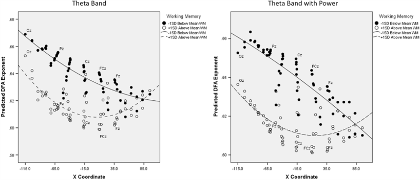
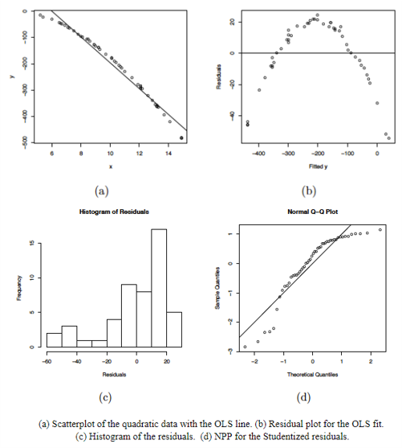
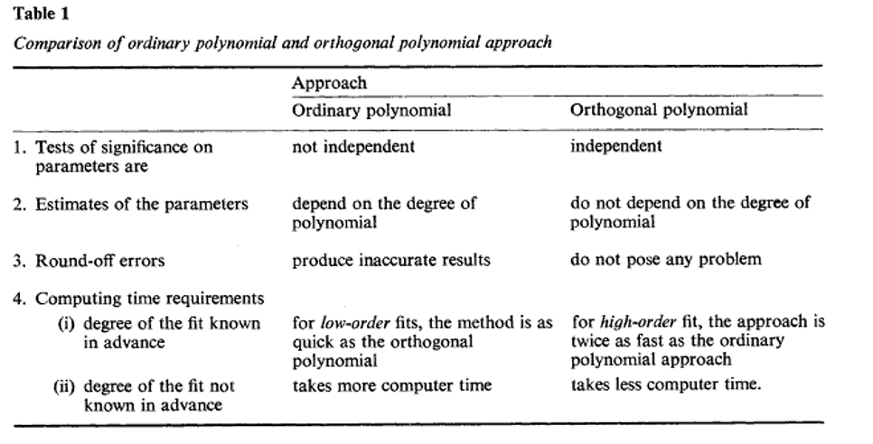

```{r setup, include=FALSE}
## libraries1
library(learnr)
library(googlesheets4)
library(tidyr)
library(dplyr)
library(ggplot2)
library(scales)
gs4_auth()
g_sheet <- "https://docs.google.com/spreadsheets/d/11yF_gMK87-POZVLrCwLc_E4CB59P7-dzNojLlMUwfxk/edit?usp=sharing"

## options
knitr::opts_chunk$set(echo = TRUE)
tutorial_options(exercise.eval = FALSE)

## recording data
new_recorder <- function(tutorial_id, tutorial_version, user_id, event, data) {
    cat(user_id, ", ", event, ",", data$label, ", ", data$answer, ", ", data$correct, "\n", sep = "", file = "student_progress.txt", append = TRUE)
  

  
g_tibble <- tibble::tibble(
user_id  = user_id, 
event = event,
label = data$label,
correct = data$correct,
question = data$question,
answer = data$answer
  )

# write to google sheets
sheet_append(g_sheet, g_tibble, sheet = 1)

}

options(tutorial.event_recorder = new_recorder)
```

## 1. Introduction


```{r, echo=FALSE, out.width="100%", fig.align = "center"}
knitr::include_graphics("images/banner.png")  
```


In this tutorial, we'll learn about sampling theory.

### Outline

What we will cover today:

1. Polynomial regression
2. When to use it
3. How to do it in R
4. Orthogonal polynomials


## Polynomial Regression

### Polynomial Regression

**Multiple**

$$Y_i=b_0+b_1X_2+b_2X_2+ ...+b_nX_n+\epsilon_i$$
- One dependent variable Y predicted from **a set of** independent variables ($X_1, X_2, …X_k$)
- One regression coefficient for each independent variable
- $R^2:$ proportion of variation in dependent variable Y predictable by <u>**set of**</u> independent variables (X’s)

**Polynomial:**

$$Y_i=b_0+b_1X+b_2X^2+ ...+b_nX^n+\epsilon_i$$

- One dependent variable Y predicted from a set of independent variables ($X_1, X_2, …X_k$)
- One regression coefficient for each independent variable
- Independent variables become **variables raised to increasing degrees of the polynomial (the exponent they are raised to)**

### When to consider polynomial regression

- **Theoretically:** When you have theory or a reason to expect the relationship between your predictor and your outcome to be <u>**curvilinear**</u>


### When to consider polynomial regression

- **Theoretically:** When you have theory or a reason to expect the relationship between your predictor and your outcome to be <u>**curvilinear**</u>


Image from: 
Euler, M. J., Wiltshire, T. J., Niermeyer, M. A., & Butner, J. E. (2016). Working memory performance inversely predicts spontaneous delta and theta-band scaling relations. Brain research, 1637, 22-33.

### When to consider polynomial regression

- **Empirically:** When you check out your scatterplots and other plots for checking the assumptions of your linear model
  - Residuals vs fit
  - Histogram of residuals
  - QQ plot




### Polynomial Regression

- The degree of the polynomial determines the number of points of inflection (-1)
- <u>**Must include all lower order terms**</u>
- Careful of over fit (generalizability of the model) 
- Practical significance vs statistical significance
- Coefs tell us direction and strength/depth of curve(s)


### Interpreting Polynomial Regression Results

- Plot them! 
- Quadratic term
  - Positive = curve opens upward (apex is lowest value)
  - Negative = curve opens downward (apex is highest values)
- Focus is more on overall model comparisons and the shape of the trend vs interpretation of individual coefs


### Running the model in R

- Manually create the polynomial terms
  - E.g., `arousal2<-arousal*arousal`
  - `arousal3<-arousal*arousal*arousal`

- Add directly into `lm()` formula
  - outcome ~ pred + I(pred^2)


## Exercises

### Run multiple regression on the data

- Load the yerkes.dods.csv data file from Canvas
- Inspect the data and generate descriptives
- Run and save linear model with perf as the outcome and arous as the predictor
- Interpret the results
- Generate and inspect the following fitted vs residual plot, histogram of the residuals, and the qq plot

- Now run and save the model adding a quadratic term (you can decide which method you want to do to add this)
- Interpret the results

### Inspect the data and generate descriptives


```{r ex11, exercise=TRUE}


```
```{r ex11-hint}
# Inspect the data
psych::describe(yerkes.dods)
plot(yerkes.dods$arous,yerkes.dods$perf)
```
```{r ex11-check}
#store
```

### Run and save linear model with perf as the outcome and arous as the predictor

```{r ex12, exercise=TRUE}


```
```{r ex12-hint}
#
mod.lin<-lm(perf~arous,data=yerkes.dods)
summary(mod.lin)
```
```{r ex12-check}
#store
```

### Generate and inspect the following fitted vs residual plot, histogram of the residuals, and the qq plot
```{r ex13, exercise=TRUE}


```
```{r ex13-hint}
#Check linearity and homscedasticity
plot(fitted(mod.lin),residuals(mod.lin), pch=20)
abline(a=0,b=0, lty=2)
#Check normality of residuals
hist(residuals(mod.lin))
qqnorm(residuals(mod.lin))
car::qqPlot(mod.lin)
##Visual Check
performance::check_model(mod.lin)


```
```{r ex13-check}
#store
```

### Now run and save the model adding a quadratic term and interpret the results


```{r ex14, exercise=TRUE}


```
```{r ex14-hint}
#Running the model with the quadratic term
mod.quad<-lm(perf~arous+I(arous^2),data=yerkes.dods)
summary(mod.quad)

```
```{r ex14-check}
#store
```

### Compare your models

- Compare your models using `anova()` and AIC
- Which model fits better?
- What is the change in the $R^2$?

- Now check out if you have any problems with multicollinearity (you may need to manually create the quadratic variable)

### Compare your models using `anova()` and AIC

```{r ex15, exercise=TRUE}


```
```{r ex15-hint}
anova(mod.lin,mod.quad)
extractAIC(mod.lin)
extractAIC(mod.quad)

performance::compare_performance(mod.lin,mod.quad)
plot(performance::compare_performance(mod.lin,mod.quad))
```
```{r ex15-check}
#store
```

### Check out if you have any problems with multicollinearity

```{r ex16, exercise=TRUE}


```
```{r ex16-hint}

```
```{r ex16-check}
#store
```

## Orthogonal polynomials 

### Orthogonal polynomials 

- Centering could work to reduce multicollinearity
- A transformation of the polynomial terms that reduces correlation
- But poses a challenge for interpretability because the b values are no longer in original metric
- Easy to do in R using `poly()` function in `lm()` formula
- See here for more but this is non-essential: [Video](https://www.youtube.com/watch?v=lrSQH_69MTM&ab_channel=MathTheBeautiful) or [webpage](http://www.stat.wmich.edu/wang/664/egs/Rpoly.html) or [visualizations](http://thejuniverse.org/PUBLIC/LinearAlgebra/LOLA/dotProd/proj.html) or [paper](https://www.jstor.org/stable/1403204?seq=1#metadata_info_tab_contents) 


### Narula (1979) 



### Run multiple regression on the data

- Load the cub.csv data file from Canvas
- Inspect the data and generate descriptives (this is simulated data)
- Make a scatterplot
- Run and save 3 models (noisy.y is outcome, q is predictor), interpret output along the way
  - Start with just a linear model
  - Then add a quadratic term using the `poly()` function in your `lm()` formula
  - Then a cubic term using the `poly()` function in your `lm()` formula
- Compare the models to see which one fits best (you need to make 3 comparisons)
- Make a plot of the fitted values of the best fitting model with the observed data as well
- Check assumptions of the best fitting model


### Create a linear model with only the centered version of IQ and Work.Ethic as predictors

- Check out and interpret the summary of the model

```{r ex21, exercise=TRUE}


```
```{r ex21-hint}
#
gpa.mod1<-lm(GPA~IQ.C+Work.Ethic.C,data=GPA.Data)
summary(gpa.mod1)

```
```{r ex21-check}
#store
```

### Create a linear model with the centered version of IQ and Work.Ethic AND the centered interaction term as predictors 

- Check out and interpret the summary of the model

```{r ex22, exercise=TRUE}


```
```{r ex22-hint}
#
gpa.mod2<-lm(GPA~IQ.C+Work.Ethic.C+IQ.WE.INT.c,data=GPA.Data)
summary(gpa.mod2)
gpa.mod3<-lm(GPA~IQ.C*Work.Ethic.C,data=GPA.Data)
summary(gpa.mod3)

```
```{r ex22-check}
#store
```

### Compare the models to see which is the better fit

```{r ex23, exercise=TRUE}


```
```{r ex23-hint}
#
anova(gpa.mod1,gpa.mod2)

extractAIC(gpa.mod1)
extractAIC(gpa.mod2) #Note how the AIC for this one is lower (more negative*)

performance::performance(gpa.mod1)
performance::performance(gpa.mod2)
plot(performance::compare_performance(gpa.mod1,gpa.mod2))

anova(gpa.mod2,gpa.mod3)

```
```{r ex23-check}
#store
```

### Get your standardized coefficients using lm.beta()

```{r ex24, exercise=TRUE}


```
```{r ex24-hint}
#
QuantPsyc::lm.beta(gpa.mod3) #note that now I am using the mod3 using the *


```
```{r ex24-check}
#store
```

### Do a global check and visual check of the assumptions for the model

```{r ex25, exercise=TRUE}


```
```{r ex25-hint}
#
require(gvlma)
gvlma(gpa.mod3)
performance::check_model(gpa.mod3)


```
```{r ex25-check}
#store
```


## Recap

### Recap

- Polynomial regression is useful when:
  - Predict the relationship between variables is curvilinear
  - Checking assumptions and observe curve-like patterns 
- Must iteratively add polynomial terms of increasing order and all lower order terms
- Compare model fit
- Sometimes polynomial terms can be too highly correlated with each other
  - Create orthogonal polynomials
  - **In practice, patterns of results should be the same**
- Next time:
  - Mixed models

