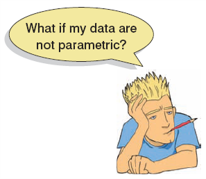
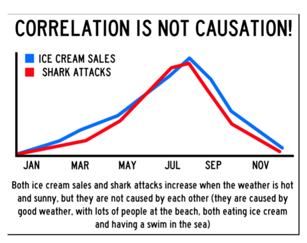

```{r setup, include=FALSE}
## libraries1
library(learnr)
library(googlesheets4)
library(tidyr)
library(dplyr)
library(ggplot2)
library(scales)
gs4_auth()
g_sheet <- "https://docs.google.com/spreadsheets/d/11yF_gMK87-POZVLrCwLc_E4CB59P7-dzNojLlMUwfxk/edit?usp=sharing"

## options
knitr::opts_chunk$set(echo = TRUE)
tutorial_options(exercise.eval = FALSE)

## recording data
new_recorder <- function(tutorial_id, tutorial_version, user_id, event, data) {
    cat(user_id, ", ", event, ",", data$label, ", ", data$answer, ", ", data$correct, "\n", sep = "", file = "student_progress.txt", append = TRUE)
  

  
g_tibble <- tibble::tibble(
user_id  = user_id, 
event = event,
label = data$label,
correct = data$correct,
question = data$question,
answer = data$answer
  )

# write to google sheets
sheet_append(g_sheet, g_tibble, sheet = 1)

}

options(tutorial.event_recorder = new_recorder)
```

## Introduction


```{r, echo=FALSE, out.width="100%", fig.align = "center"}
knitr::include_graphics("images/banner.png")  
```


### Outline

**there is missing exercise 1?**

What we will cover today:

1. Correlation (revisited)
2. Nonparametric measures
    - Spearman’s rho
    - Kendall’s tau
3. Interpreting correlations
    + Causality
4. Partial correlations
5. Syllabus/Open Stats Lab
6. PE updates

### LearnR

1. Optional
2. Have a Swirl equivalent

## Quiz


### Question 1
```{r Quiz1}
  question("How do you estimate the amount of overlap in variance between two variables using the
correlation (r)?",
    answer("Divide it by 2", correct = TRUE),
    answer("Square it"),
    answer("Take the square root"),
    answer("Divide by standard error"),
    incorrect = "Hint: Try again, you can pick another answer!",
    allow_retry = TRUE
    )
```


### Question 2
```{r Quiz2}
  question("An estimate of the the correlation between Scoville Heat Units in various chili peppers and
perceived pain is .7. What size effect is this? ",
    answer("Small"),
    answer("Medium"),
    answer("Large", correct = TRUE),
    answer("No idea"),
    incorrect = "Hint: Try again, you can pick another answer!",
    allow_retry = TRUE
    )
```
### Question 3
```{r Quiz3}
 question("The null hypothesis for a correlation test is which of the following? ",
    answer("The correlation is positive"),
    answer("The correlation is negative"),
    answer("The correlation is different than 0"),
    answer("The correlation is equal to 0", correct = TRUE),
    incorrect = "Hint: Try again, you can pick another answer!",
    allow_retry = TRUE
    )
```
### Question 4
```{r Quiz4}
question("How glad are you to have the option to attend lectures on campus?",
    answer("1"),
    answer("2"),
    answer("3"),
    answer("4"),
    answer("5", correct=TRUE),
    answer("6"),
    answer("7"),
    answer("8"),
    answer("9"),
    answer("10"),
    incorrect = "Hint: Try again, you can pick another answer!",
    allow_retry = TRUE
    )
```

## 1. Correlation (revisited)

### Covariance

- Calculate the error between the mean and each subject’s score for the first variable (x).
- Calculate the error between the mean and their score for the second variable (y).
- Multiply these error values.
- Add these values and you get the cross product deviations.
- The covariance is the average cross-product deviations:


$$cov(x,y)=\frac{\sum_{i=1}^{N}(x_{i}-\bar{x})(y_{i}-\bar{y})}{N-1}$$


### Pearson's Correlation Coefficient


$$ r =\frac{ cov_{xy} }{s_{x}s_{y}}$$


$$r =\frac{ cov_{xy} }{s_{x}s_{y}}=\\ =\frac{ 4.25 }{1.67\times2.92 } = \\= .87$$

### Things to Know about the Correlation

- It varies between -1 and +1
  + 0 = no relationship
- It is an effect size
  + ±.1 = small effect
  + ±.3 = medium effect
  + ±.5 = large effect
- Coefficient of determination, $r^2$
  + By squaring the value of r you get the proportion of variance in one variable shared by the other. Variance accounted for by…


### More Correlation Testing in R

- Load the Exam Anxiety.dat file into R using `read.delim()` function
  - 103 participants, variables indicated Time spent revising (hours), Exam performance (%), Exam Anxiety (the EAQ, score out of 100), Gender
  - Make a prediction about the relationship between exam performance and anxiety and test it using the `cor.test()` function 
    - What did you observe? Was there a significant correlation? What is the size (small, medium, large)?
    -What is the r2 value? What does this mean?
- Generate an exploratory correlation matrix using the `correlate()` function from the `lsr` package. How do you interpret this?


### 1. Loading Exam Anxiety data

```{r ex11, exercise=TRUE}
# your code here
```
```{r ex11-hint}
exam_data<-read.delim(file="Exam Anxiety.dat",header=TRUE)
cor.test(exam_data$Exam, exam_data$Anxiety, method = "pearson", alternative='less')
```
```{r ex11-check}
#store
```

### 2. Relation between Revising and Anxiety


```{r ex12, exercise=TRUE}


```
```{r ex12-hint}
cor.test(exam_data$Revise, exam_data$Anxiety, method = "pearson", alternative='less')
```
```{r ex12-check}
#store
```

### 3. Generate a correlation matrix

```{r ex13, exercise=TRUE}


```
```{r ex13-hint}

require(lsr)
correlate(exam_data)
```
```{r ex13-check}
#store
```


### Reporting results of a correlation

- Exam performance was significantly correlated with exam anxiety, r = .44, and time spent revising, r = .40; the time spent revising was also correlated with exam anxiety, r = .71 (all ps < .001).
- **Remember it is best to report exact p-values, but these are all very very small.** 


## 2. Non-parametric measures


### Non-parametric Correlations


**(some) assumptions of Pearson’s Correlation:**

- Interval or ratio scale data
- Normally distributed

**We can then use:**

- [Spearman’s rho](https://www.youtube.com/watch?v=RIfISCTEE2M&feature=youtu.be)
  - Pearson’s correlation on the ranked data
- [Kendall’s tau](https://www.youtube.com/watch?v=oXVxaSoY94k)
  - Better than Spearman’s for small samples




### Exercise: More Correlation Testing in R

- Load the The Biggest Liar.dat file into R.
  - 68 participants, variables indicate where they were placed in the competition (first, second, third, etc.), Creativity questionnaire (maximum score 60)
  - Make a prediction about the relationship between position in the competition and creativity and test it using the `cor.test()` function use method spearman and kendall
    - What did you observe? Was there a significant correlation? What is the size (small, medium, large)? Do both analyses give you similar conclusions?
    - How would you report your findings? Try to summarize your results in a write up.  

### 1. Loading The Biggest Liar data

```{r ex21, exercise=TRUE}
#Require 
```
```{r ex21-hint}

liar_data <- read.delim("The Biggest Liar.dat")
```
```{r ex21-check}
#store
```

### 2. Add exact argument to avoid warning

```{r ex22, exercise=TRUE}
#Require 
```
```{r ex22-hint}

cor.test(liar_data$Position, liar_data$Creativity,method="spearman", alternative = 'less', exact=FALSE)
cor.test(liar_data$Creativity,liar_data$Position, method="kendall", alternative = 'less')
```
```{r ex22-check}
#store
```

### 3. Partial and semi-partial correlation


```{r ex23, exercise=TRUE}
#Require 
```
```{r ex23-hint}
require(ppcor)
exam_data2<-exam_data[,c("Exam","Anxiety","Revise")]
```
```{r ex23-check}
#store
```

### Correlation and Causality

- The third-variable problem:
  - In any correlation, causality between two variables cannot be assumed because there may be other measured or unmeasured variables affecting the results.
- Direction of causality:
  - Correlation coefficients say nothing about which variable causes the other to change.

Check [this out](https://tylervigen.com/discover) for some interesting spurious correlations




## 3. Partial and Semi-partial Correlations

### Correlations:

- Partial correlation:
  - Measures the relationship between two variables, controlling for the effect that a third variable has **on them both.**
- Semi-partial correlation:
  - Measures the relationship between two variables controlling for the effect that a third variable has **on only one of the others.**


### Partial and Semi-partial Correlations

Use for when you think that the confounding variable does not influence both variables.   


Need more details? Watch [this video](https://www.youtube.com/watch?v=OpAf4N582bA).

### Doing Partial Correlation using R

- Need ‘ppcor’ package
- The general form of `pcor.test()` is:
  - `pcor.test(x,y,z)`
- X and Y are the main variables of interest
- Z is the one you want to control for

### Doing Semi-Partial Correlation using R

- The general form of `spcor.test()` is:
  - `spcor.test(x,y,z)`
- X and Y are the main variables of interest
- Z is the one you want to control for, and it’s relationship with Y (the second variable entered) 


### Exercise 3: Partial and Semi-Partial Correlation Testing in R

- Load the Exam Anxiety.dat file into R.
- Install and load the `ppcor` package
- Optional: Create a new data frame that only contains the variables "Exam","Anxiety","Revise“
  - Run partial correlation test to see the relationship between exam score and revision time, while controlling for anxiety (use `pcor.test()`)
  - Run a semi-partial correlation test to see the relationship between exam score and revision time, while controlling for the effect of anxiety on exam score only (use `spcor.test()`)

### 1. Run individual tests

```{r ex31, exercise=TRUE}
#Require pcor, spcor
```
```{r ex31-hint}

pcor.test(exam_data2$Revise,exam_data2$Exam,exam_data2$Anxiety)
spcor.test(exam_data2$Revise,exam_data2$Exam,exam_data2$Anxiety)
```
```{r ex31-check}
#store
```

### 2. Test them all at once

```{r ex32, exercise=TRUE}
#Require pcor, spcor
```
```{r ex32-hint}


pcor(exam_data2)
spcor(exam_data2)
```
```{r ex32-check}
#store
```

### 3. An alternative method

```{r ex33, exercise=TRUE}
#Require ggm
```
```{r ex33-hint}

require(ggm)
pc<-pcor(c("Exam","Anxiety","Revise"),var(exam_data2))
pcor.test(pc,1,103) #The 1 indicates we are only controlling for 1 variable, and the 103 is the sample size
```
```{r ex33-check}
#store
```

### Easystats: correlation package


### 1. Load packages

```{r ex41, exercise=TRUE}
#Require pcor, spcor
```
```{r ex41-hint}
require(correlation)
library(dplyr)
library(see)

```
```{r ex41-check}
#store
```

### 2. Plot results

```{r ex42, exercise=TRUE}
#Require pcor, spcor
```
```{r ex42-hint}
results <- correlation(exam_data)
results

results %>%
  summary(redundant = TRUE) %>%
  plot()
```
```{r ex42-check}
#store
```

### 3. Partial correlations

```{r ex43, exercise=TRUE}
#partial correlations
```
```{r ex43-hint}

exam_data %>%
 correlation(partial=TRUE) %>%
summary()
```
```{r ex43-check}
#store
```


## Summing Up

- Correlations
  - Positive, negative and range from -1 to 1
  - Small, medium, large effects
  - Not causal
- Non parametric
  - If data are non-interval/ratio or non normal
- Partial/semi-partial correlations
- Syllabus/Open Stats Lab
- PE updates

