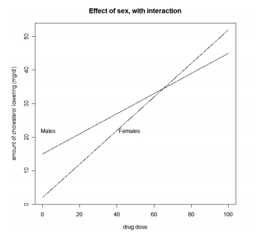
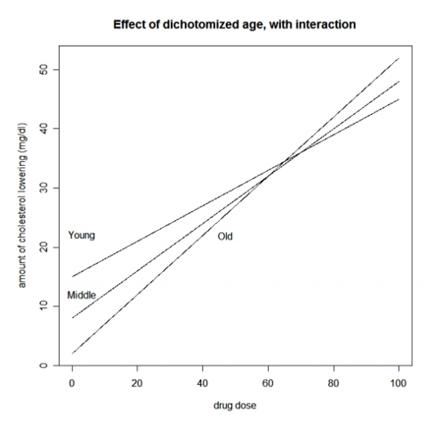
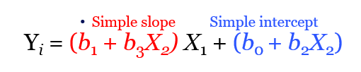
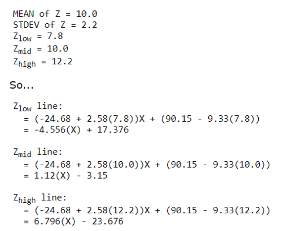
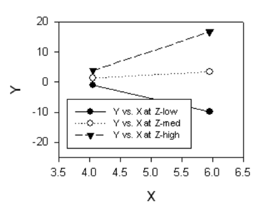
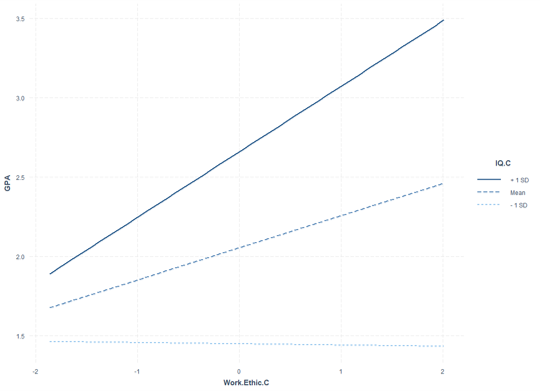
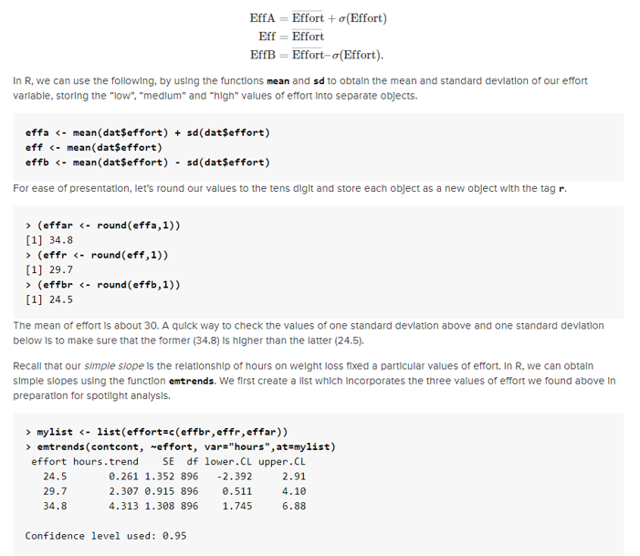
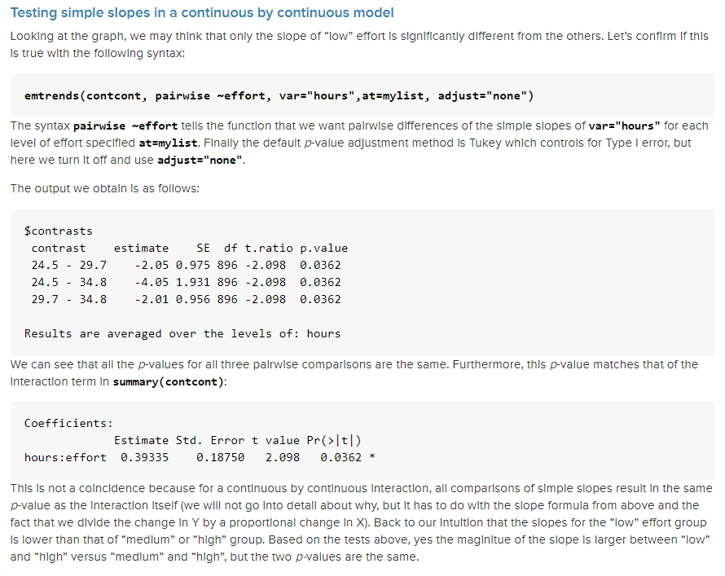

```{r setup, include=FALSE}
## libraries1
library(learnr)
library(googlesheets4)
library(tidyr)
library(dplyr)
library(ggplot2)
library(scales)
gs4_auth()
g_sheet <- "https://docs.google.com/spreadsheets/d/11yF_gMK87-POZVLrCwLc_E4CB59P7-dzNojLlMUwfxk/edit?usp=sharing"

## options
knitr::opts_chunk$set(echo = TRUE)
tutorial_options(exercise.eval = FALSE)

## recording data
new_recorder <- function(tutorial_id, tutorial_version, user_id, event, data) {
    cat(user_id, ", ", event, ",", data$label, ", ", data$answer, ", ", data$correct, "\n", sep = "", file = "student_progress.txt", append = TRUE)
  

  
g_tibble <- tibble::tibble(
user_id  = user_id, 
event = event,
label = data$label,
correct = data$correct,
question = data$question,
answer = data$answer
  )

# write to google sheets
sheet_append(g_sheet, g_tibble, sheet = 1)

}

options(tutorial.event_recorder = new_recorder)
```

## 1. Introduction


```{r, echo=FALSE, out.width="100%", fig.align = "center"}
  
```


In this tutorial, we'll learn about sampling theory.

### Outline

What we will cover today:

1. Simple vs multiple regression
2. Multiple regression w interactions
3. Creating interaction terms
4. Understanding interactions


### What do you know about sampling so far?

### Question 1
```{r Quiz1,  echo=FALSE}
question("What type of sampling is most commonly used in university settings?",
    answer("Snowball", correct = TRUE),
    answer("Convenience"),
    answer("Random"),
    answer("Volunteer"),
    answer("Opportunity"),
    incorrect = "Hint: Try again, you can pick another answer!",
    allow_retry = TRUE
    )
```


## Simple vs. Multiple Regression

### Simple vs. Multiple Regression

**Simple**

$$Y_i=b_0+b_iX_i+\epsilon_i$$

- One dependent variable Y predicted from one independent variable X
- One regression coefficient
- $R^2:$ proportion of variation in dependent variable Y predictable from X


**Multiple**

$$Y_i=b_0+b_1X_2+b_2X_2+ ...+b_nX_n+\epsilon_i$$
- One dependent variable Y predicted from **a set of** independent variables ($X_1, X_2, …X_k$)
- One regression coefficient for each independent variable
- $R^2:$ proportion of variation in dependent variable Y predictable by <u>**set of**</u> independent variables (X’s)

### Multiple Regression with an Interaction

$$Y_i=b_0+b_1X_2+b_2X_2+b_3X_1X_2+\epsilon_i$$

- **Interaction:**
  - When the effect of one predictor differs based on the level or magnitude of another predictor variable
  - This is also a form of moderation effect

### Some interaction examples




  
### What kind of research questions can we answer with interactions? 

- What is the predicted Y given a particular $X_1$ and $X_2$? (predicted value)
- What is relationship of $X_1$ on $Y$ at particular values of $X_2$? (simple slopes/effects)
- Is there a difference in the relationship of $X_1$ on $Y$ for different values of $X_2$? (comparing simple slopes)

### Creating interaction terms

- We could simply create a new variable by multiplying our two predictors
- `Newvar<-var1*var2`
- Then we can include this in our linear model `lm()`
- This could be useful for checking out issues with multicollinearity (but it’s not how we would typically model interactions)

### Avoiding Multi Collinearity

- Can use centering to avoid issues with multicollinearity arising from interaction terms
- Not always necessary
  - See: Iacobucci, D., Schneider, M. J., Popovich, D. L., & Bakamitsos, G. A. (2016). Mean centering helps alleviate “micro” but not “macro” multicollinearity. Behavior research methods, 48(4), 1308-1317.


## Exercises

### Preparing some data to test an interaction

- Load the GPA.Data.csv file from Canvas
- Create an interaction variable for IQ and Work.Ethic
- Generate descriptive statistics for the data and interpret them
- Generate correlation matrix and evaluate that
- Center IQ and Work.Ethic (save these as new variables)
  - hint: use scale function, but not all arguments should be true
- Create a new interaction term with the centered IQ and Work.Ethic
- Check out the correlation matrix now

### Load the GPA.Data.csv file from Canvas

### Create an interaction variable for IQ and Work.Ethic


```{r ex11, exercise=TRUE}


```
```{r ex11-hint}
#
GPA.Data$IQ.WE.INT<-GPA.Data$IQ*GPA.Data$Work.Ethic #This one creates a multicollinearity problem
GPA.Data$IQ.WE.INT.c<-GPA.Data$IQ.C*GPA.Data$Work.Ethic.C #This one looks much better
cor(GPA.Data)
```
```{r ex11-check}
#store
```

### Generate descriptive statistics for the data and interpret them

```{r ex12, exercise=TRUE}


```
```{r ex12-hint}
#
psych::describe(GPA.Data)


```
```{r ex12-check}
#store
```

### Generate correlation matrix and evaluate that
```{r ex13, exercise=TRUE}


```
```{r ex13-hint}
#
cor(GPA.Data)


```
```{r ex13-check}
#store
```

### Center IQ and Work.Ethic (save these as new variables)
hint use scale function, but not all arguments should be true

```{r ex14, exercise=TRUE}


```
```{r ex14-hint}
#
GPA.Data$IQ.C <- scale(GPA.Data$IQ, center = TRUE, scale = FALSE)[,]
GPA.Data$Work.Ethic.C <- scale(GPA.Data$Work.Ethic, center = TRUE, scale = FALSE)[,]
GPA.Data$IQ.C <- as.numeric(scale(GPA.Data$IQ, center = TRUE, scale = FALSE))

```
```{r ex14-check}
#store
```

### Create a new interaction term with the centered IQ and Work.Ethic

 Also check out the correlation matrix now

```{r ex15, exercise=TRUE}


```
```{r ex15-hint}
#
GPA.Data$IQ.WE.INT<-GPA.Data$IQ*GPA.Data$Work.Ethic #This one creates a multicollinearity problem
GPA.Data$IQ.WE.INT.c<-GPA.Data$IQ.C*GPA.Data$Work.Ethic.C #This one looks much better
cor(GPA.Data)
```
```{r ex15-check}
#store
```


### Run multiple regression on the data

- Create a linear model with only the centered version of IQ and Work.Ethic as predictors
  - Check out and interpret the summary of the model
- Create a linear model with the centered version of IQ and Work.Ethic AND the centered interaction term as predictors 
  - Check out and interpret the summary of the model
- Compare the models to see which is the better fit
- Get your standardized coefficients using lm.beta()
- Do a global check and visual check of the assumptions for the model


### Create a linear model with only the centered version of IQ and Work.Ethic as predictors

- Check out and interpret the summary of the model

```{r ex21, exercise=TRUE}


```
```{r ex21-hint}
#
gpa.mod1<-lm(GPA~IQ.C+Work.Ethic.C,data=GPA.Data)
summary(gpa.mod1)

```
```{r ex21-check}
#store
```

### Create a linear model with the centered version of IQ and Work.Ethic AND the centered interaction term as predictors 

- Check out and interpret the summary of the model

```{r ex22, exercise=TRUE}


```
```{r ex22-hint}
#
gpa.mod2<-lm(GPA~IQ.C+Work.Ethic.C+IQ.WE.INT.c,data=GPA.Data)
summary(gpa.mod2)
gpa.mod3<-lm(GPA~IQ.C*Work.Ethic.C,data=GPA.Data)
summary(gpa.mod3)

```
```{r ex22-check}
#store
```

### Compare the models to see which is the better fit

```{r ex23, exercise=TRUE}


```
```{r ex23-hint}
#
anova(gpa.mod1,gpa.mod2)

extractAIC(gpa.mod1)
extractAIC(gpa.mod2) #Note how the AIC for this one is lower (more negative*)

performance::performance(gpa.mod1)
performance::performance(gpa.mod2)
plot(performance::compare_performance(gpa.mod1,gpa.mod2))

anova(gpa.mod2,gpa.mod3)

```
```{r ex23-check}
#store
```

### Get your standardized coefficients using lm.beta()

```{r ex24, exercise=TRUE}


```
```{r ex24-hint}
#
QuantPsyc::lm.beta(gpa.mod3) #note that now I am using the mod3 using the *


```
```{r ex24-check}
#store
```

### Do a global check and visual check of the assumptions for the model

```{r ex25, exercise=TRUE}


```
```{r ex25-hint}
#
require(gvlma)
gvlma(gpa.mod3)
performance::check_model(gpa.mod3)


```
```{r ex25-check}
#store
```


## Simple Slopes

### How do we further our understanding of interactions? 

- **decompose:** to break down the interaction into its lower order components (i.e., predicted means or simple slopes)
- **probe:** to use hypothesis testing to assess the statistical significance of simple slopes and simple slope differences (i.e., interactions)
- **plot:** to visually display the interaction in the form of simple slopes such as values of the dependent variable are on the y-axis, values of the predictor is on the x-axis, and the moderator separates the lines or bar graph’

Ideas from: 
https://stats.idre.ucla.edu/r/seminars/interactions-r/

### Calculating Simple Slopes: 
$$Y_i=b_0+b_1X_2+b_2X_2+b_3X_1X_2+\epsilon_i$$

$Y_i=\color{red}{(b_1+b_3X_2)X_1}+\color{blue}{(b_0+b_2X_2)}$
- Simple slope: $\color{red}{(b_1+b_3X_2)X_1}$
- Simple intercept: $\color{blue}{(b_0+b_2X_2)}$


$$Y_i=(b_1+b_3X_2)X_1+(b_0+b_2X_2)$$
$\hat{Y}=90.15-24.68(X) -9.33(Z)+2.58(XZ)$
$\hat{Y}= (b_1+b_3Z)X_1+(b_0+b_2(Z))\\=(-24.68+2.58(Z))X+(90.15-9.33(Z))$


### Plotting Simple Slopes to Understand the Interactions

- Choose certain values of one of our predictors to compute simple slopes
  - Commonly use +/- 1 SD from the mean
  - Can also choose your own (or may be limited if there is categories)
  - Or use quantiles



### Plotting Simple Slopes to Understand the Interactions




### Easy plotting of simple slopes in R

- Using “rockchalk” package:
  - `plotSlopes(model.object, plotx=X1, modx=X2, modxVals='std.dev', legendTitle=‘X2’)`
- Using “interactions” package:
  - `interact_plot(model.object, pred = X1, modx = X2)`



### Using the emmeans package to get simple slopes

-Decompose:



- Probe: 




From: 
https://stats.idre.ucla.edu/r/seminars/interactions-r/

## Exercises

### Decompose and Probe the interaction effect (s18)

- Install and load the ‘emmeans’ package
- Check out the arguments of the `emtrends()` function
- Create a list variable that includes the three values of IQ.C at the mean, plus 1 SD above the mean, and minus 1 SD below the mean
- Examine the simple slopes for WorkEthic.C using `emtrends()`. What do they show? Do they appear different?
- Modify your input to the `emtrends()` function to Probe the simple slopes and test if any of these are different than each other. 

### Extracting the estimated marginal means and simple slopes

```{r ex31, exercise=TRUE}


```
```{r ex31-hint}
#
require(emmeans)
summary(GPA.Data$IQ.C)

```
```{r ex31-check}
#store
```

### Create IQ values at, and +/1 1 SD from the mean

```{r ex32, exercise=TRUE}


```
```{r ex32-hint}
#
IQplus <- round(mean(GPA.Data$IQ.C) + sd(GPA.Data$IQ.C),1)
IQ <- round(mean(GPA.Data$IQ.C),1)
IQminus <-round(mean(GPA.Data$IQ.C) - sd(GPA.Data$IQ.C),1)
mylist <- list(IQ.C=c(IQplus,IQ,IQminus) )

```
```{r ex32-check}
#store
```

### Now examine the simple slopes of work ethic at the levels of IQ

 Do they appear different?

```{r ex33, exercise=TRUE}


```
```{r ex33-hint}
#
emtrends(gpa.mod3,~IQ.C,var = "Work.Ethic.C", at=mylist)


```
```{r ex33-check}
#store
```

### Testing the simple slopes

```{r ex34, exercise=TRUE}


```
```{r ex34-hint}
#
emtrends(gpa.mod3,pairwise ~IQ.C,var = "Work.Ethic.C" ,at=mylist,adjusts='none')

```
```{r ex34-check}
#store
```

### Plot the simple slopes (s19)

Install and load the ‘rockchalk’ and ‘interactions’ package
Check out the arguments of the `plotSlopes()` function
Use `plotSlopes` to make a graph that shows the simple slopes for IQ.C
Reverse the order of entry of the IVs and plot the simple slopes
Check out the arguments of the `interact_plot()` function
Use `interact_plot()` to make a graph that shows the simple slopes for IQ.C

### Load/install ‘rockchalk’ and ‘interactions’ package

```{r ex41, exercise=TRUE}


```
```{r ex41-hint}
#

```
```{r ex41-check}
#store
```

### Use `plotSlopes` to make a graph that shows the simple slopes for IQ.C

```{r ex42, exercise=TRUE}


```
```{r ex42-hint}
#
gpa.simp<-plotSlopes(gpa.mod3,plotx='Work.Ethic.C',modx='IQ.C',modxVals='std.dev', legendTitle='IQ.C')

gpa.simp<-plotSlopes(gpa.mod3,plotx='IQ.C',modx='Work.Ethic.C',modxVals='std.dev', legendTitle='IQ.C')

```
```{r ex42-check}
#store
```

### Use `interact_plot()` to make a graph that shows the simple slopes for IQ.C

```{r ex43, exercise=TRUE}


```
```{r ex43-hint}
#
interact_plot(gpa.mod3, pred = Work.Ethic.C, modx = IQ.C)
interact_plot(gpa.mod3, pred = IQ.C, modx = Work.Ethic.C)


```
```{r ex43-check}
#store
```

### Data analysis of Dutch Lexicon Project (s20)

1. retrieve the tab delimited files for stimulus characteristics and average reaction times from http://crr.ugent.be/programs-data/lexicon-projects
2. load the data in R
3. merge the two data frames such that for each spelling we have its OLD20 (the average distance of the 20 most similar words based on orthography), its lexicality (whether it is a word or a non-word), its frequency in the subtlex corpus and its average reaction time (RT)
4. fit a linear regression predicting RTs as a linear combination of OLD20 and lexicality
5. fit a linear regression predicting RTs based on the interaction between OLD20 and lexicality
6. compare the two models and determine which one provides the best fit
7. fit a linear regression predicting RTs using frequency. How could you decide whether this model is better than the best model you found before?


