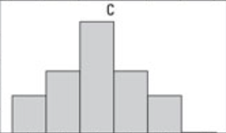
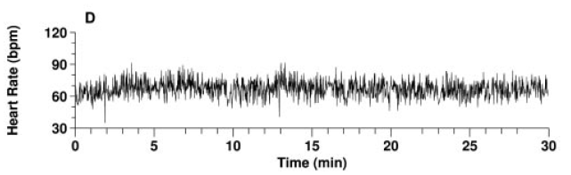
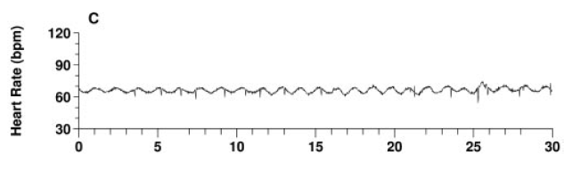

```{r setup, include=FALSE}
## libraries
library(learnr)
library(tidyr)
library(dplyr)
library(ggplot2)
library(scales)
## DB packages conditionally used

## Toggle: enable/disable database features
use_database <- tolower(Sys.getenv("LEARNR_USE_DB", "false")) %in% c("1", "true", "yes", "on")

if (use_database) {
  if (!requireNamespace("DBI", quietly = TRUE) || !requireNamespace("pool", quietly = TRUE)) {
    message("DBI/pool not available; disabling database features for plots.")
    use_database <- FALSE
  }
}

pool <- NULL
if (use_database) {
  ## Prefer RMariaDB if available, otherwise RMySQL
  drv <- NULL
  if (requireNamespace("RMariaDB", quietly = TRUE)) {
    drv <- RMariaDB::MariaDB()
  } else if (requireNamespace("RMySQL", quietly = TRUE)) {
    drv <- RMySQL::MySQL()
  }
  if (!is.null(drv)) {
    pool <- try(pool::dbPool(
      drv = drv,
      dbname = "statistics_II",
      host = "185.57.8.99",
      username = "admin",
      password = "SeamlessAdmin2022!"
    ), silent = TRUE)
    if (inherits(pool, "try-error")) {
      message("DB pool creation failed; disabling database features for plots.")
      use_database <- FALSE
      pool <- NULL
    }
  } else {
    use_database <- FALSE
  }
}

## options
knitr::opts_chunk$set(echo = TRUE)
tutorial_options(exercise.eval = FALSE, exercise.checker=FALSE)

## recording data
new_recorder <- function(tutorial_id, tutorial_version, user_id, event, data) {
    cat(user_id, ", ", event, ",", data$label, ", ", data$answer, ", ", data$correct, "\n", sep = "", append = TRUE)
  
d_tibble <- tibble::tibble(
user_id  = user_id, 
event = event,
label = data$label,
correct = data$correct,
question = data$question,
answer = data$answer
  )

## send to mysql
  if (use_database && !is.null(pool)) {
    DBI::dbWriteTable(pool, "testing", d_tibble, append=TRUE, row.names = FALSE)
  }
}

options(tutorial.event_recorder = new_recorder)

## Clean up on stop
if (use_database && !is.null(pool)) {
  onStop(function() {
    try(pool::poolClose(pool), silent = TRUE)
  })
}

```


## Word cloud

### Where are you from?
```{r Quiz1,  echo=FALSE}
question_text(
  "Where are you from?",
  answer("secret", correct = TRUE),
  allow_retry = FALSE,
  trim = FALSE,
  incorrect = "Answer saved",
  correct = "Answer saved"

)
```

### Results: Where are you from?
```{r, Quiz1O, echo = FALSE}
if (isTRUE(use_database)) {
  plotOutput("Q1")
}
```

```{r, Quiz1R, context="server", echo = FALSE, warning = FALSE, message=FALSE, out.width="100%", fig.align = "center"}

if (use_database && !is.null(pool)) {
  output$Q1 <- renderPlot({
  
  library(ggwordcloud)
  ## Getting the data
    data <- DBI::dbGetQuery(pool, "SELECT * FROM testing")
  ## Cleaning the data
  answers <- subset(data, data$label == "Quiz1",)
  answers[answers==""] <- NA
  answers <- na.omit(answers)
  answers_count <- as.data.frame(answers %>% 
  count(answer))
  total_n = nrow(answers)
  answers_count$percentage <- (answers_count$n/total_n)*100
  answers_count$correct <- ifelse(answers_count$answer == "`lm(affect ~ poly(stress, 2) + performance)`", "Correct", "Incorrect")

  ## Making the plot
  ggplot(
    answers_count,
    aes(
      label = answer, size = n,
      color = factor(sample.int(10, nrow(answers_count), replace = TRUE))
      )
  ) +
    geom_text_wordcloud_area() +
    scale_size_area(max_size = 24) +
    theme_minimal()
  })
}
```

## Regular quizzes

### Which of the following models shows orthogonal polynomial regression with a quadratic term?

```{r Quiz11,  echo=FALSE}
  question("Which of the following models shows orthogonal polynomial regression with a quadratic term?",
    answer("`lm(affect ~ stress + I(stress^2))`"),
    answer("`lm(affect ~ stress * performance)`"),
    answer("`lm(affect ~ poly(stress, 2) + performance)`", correct = TRUE),
    answer("`lm(affect ~ poly(stress, 3) + performance)`"),
    allow_retry = FALSE
    )
```


### Results: Which of the following models shows orthogonal polynomial regression with a quadratic term?

```{r, Quiz11O, echo = FALSE}
if (isTRUE(use_database)) {
  plotOutput("Q11")
}
```

```{r, Quiz11R, context="server", echo = FALSE, warning = FALSE, message=FALSE, out.width="100%", fig.align = "center"}

if (use_database && !is.null(pool)) {
  output$Q11 <- renderPlot({
    data <- DBI::dbGetQuery(pool, "SELECT * FROM testing")
  
  answers <- subset(data, data$label == "Quiz11",)
  answers[answers==""] <- NA
  answers <- na.omit(answers)

  answers_count <- as.data.frame(answers %>% 
  count(answer))
  total_n = nrow(answers)
  answers_count$percentage <- (answers_count$n/total_n)*100
  answers_count$correct <- ifelse(answers_count$answer == "`lm(affect ~ poly(stress, 2) + performance)`", "Correct", "Incorrect")

  ggplot(answers_count,
         aes(x = percentage,
             y = answer,
             fill=correct
             )
         ) +
    geom_col(width=0.6) +theme_minimal() + scale_fill_brewer(palette="Paired", direction=-1)  +
    xlab("Percentage (%)") + ylab("Answer") + labs(fill = "Correct")
  })
}
```

## Pictures in quizzes
### Which one of these shows a normal distribution?
```{r Quiz20,  echo=FALSE}

	question("Which one of these shows a normal distribution?",
	 	 answer(
			htmltools::img( src = "images/A.png"), 
			),
	         
	 answer(
			htmltools::img( src = "images/B.png"), 
			),
	 
		answer(
			htmltools::img(
				src = "images/C.png"
			), 
			correct = TRUE
		),
	  incorrect = "Hint: Try again, you can pick another answer!",
    allow_retry = TRUE
	)

```

### Results: Which one of these shows a normal distribution?

```{r, Quiz20O, echo = FALSE}
plotOutput("Q20")
```


```{r, Quiz20R, context="server", echo = FALSE, warning = FALSE, message=FALSE, out.width="100%", fig.align = "center"}
output$Q20 <- renderPlot({

data <- dbGetQuery(pool, "SELECT * FROM testing")

answers <- subset(data, data$label == "Quiz20",)
answers[answers=="<NA>"] <- NA
answers <- na.omit(answers)

answers_count <- as.data.frame(answers %>% 
  count(answer))
total_n = nrow(answers)
answers_count$percentage <- (answers_count$n/total_n)*100
answers_count$correct <- ifelse(answers_count$answer == '', "Correct", "Incorrect")

ggplot(answers_count,
       aes(x = percentage,
           y = answer,
           fill=correct
           )
       ) +
  geom_col(width=0.6) +theme_minimal() + scale_fill_brewer(palette="Paired", direction=-1)  +
  xlab("Percentage (%)") + ylab("Answer") + labs(fill = "Correct") 
})
```


### Which of the following heart rate signals comes from a healthy person? 

```{r Quiz23,  echo=FALSE}

	question("Which of the following heart rate signals comes from a healthy person? ",
	 	 answer(
			htmltools::img( src = "images/Heartrate_A.png"), 
			),
	         
	 answer(
			htmltools::img( src = "images/Heartrate_B.png"), 
			),
	 
		answer(
			htmltools::img(
				src = "images/Heartrate_C.png"
			), 
			correct = TRUE
		),
	 		answer(
			htmltools::img(
				src = "images/Heartrate_D.png"
			), 
			correct = TRUE
		),
	  incorrect = "Hint: Try again, you can pick another answer!",
    allow_retry = TRUE
	)

```


### Results: Which of the following heart rate signals comes from a healthy person? 

```{r, Quiz23O, echo = FALSE}
plotOutput("Q23")
```


```{r, Quiz23R, context="server", echo = FALSE, warning = FALSE, message=FALSE, out.width="100%", fig.align = "center"}
output$Q23 <- renderPlot({

data <- dbGetQuery(pool, "SELECT * FROM testing")

answers <- subset(data, data$label == "Quiz23",)
answers[answers=="<NA>"] <- NA
answers <- na.omit(answers)

answers_count <- as.data.frame(answers %>% 
  count(answer))
total_n = nrow(answers)
answers_count$percentage <- (answers_count$n/total_n)*100
answers_count$correct <- ifelse(answers_count$answer %in% c('',''), "Correct", "Incorrect")
ggplot(answers_count,
       aes(x = percentage,
           y = answer,
           fill=correct
           )
       ) +
  geom_col(width=0.6) +theme_minimal() + scale_fill_brewer(palette="Paired", direction=-1)  +
  xlab("Percentage (%)") + ylab("Answer") + labs(fill = "Correct")
})
```
### What kind of change is it?

{#id .class width=100%}


```{r Quiz21,  echo=FALSE}

	question("What kind of change is it?" ,
	 	 answer(
			"A) First-Order", 
			),
	         
	 answer(
			"B) Second-Order", 
			),
	 
		answer(
			"C) Third-Order", 
			correct = TRUE
		),
	  incorrect = "Hint: Try again, you can pick another answer!",
    allow_retry = TRUE
	)

```

### Results: What kind of change is it?

```{r, Quiz21O, echo = FALSE}
plotOutput("Q21")
```


```{r, Quiz21R, context="server", echo = FALSE, warning = FALSE, message=FALSE, out.width="100%", fig.align = "center"}
output$Q21 <- renderPlot({

data <- dbGetQuery(pool, "SELECT * FROM testing")

answers <- subset(data, data$label == "Quiz21",)
answers[answers=="<NA>"] <- NA
answers <- na.omit(answers)

answers_count <- as.data.frame(answers %>% 
  count(answer))
total_n = nrow(answers)
answers_count$percentage <- (answers_count$n/total_n)*100
answers_count$correct <- ifelse(answers_count$answer == "C) Third-Order", "Correct", "Incorrect")

ggplot(answers_count,
       aes(x = percentage,
           y = answer,
           fill=correct
           )
       ) +
  geom_col(width=0.6) +theme_minimal() + scale_fill_brewer(palette="Paired", direction=-1)  +
  xlab("Percentage (%)") + ylab("Answer") + labs(fill = "Correct")
})
```


### Do you think it exhibits self-organization?

{#id .class width=100%}

```{r Quiz22,  echo=FALSE}

	question("Do you think it exhibits self-organization?" ,
	 	 answer(
			"Yes", correct = TRUE, 
			),
	         
	 answer(
			"No", 
			),
	 
	  incorrect = "Hint: Try again, you can pick another answer!",
    allow_retry = TRUE
	)

```

### Results: Do you think it exhibits self-organization?

```{r, Quiz22O, echo = FALSE}
plotOutput("Q22")
```


```{r, Quiz22R, context="server", echo = FALSE, warning = FALSE, message=FALSE, out.width="100%", fig.align = "center"}
output$Q22 <- renderPlot({

data <- dbGetQuery(pool, "SELECT * FROM testing")

answers <- subset(data, data$label == "Quiz22",)
answers[answers=="<NA>"] <- NA
answers <- na.omit(answers)

answers_count <- as.data.frame(answers %>% 
  count(answer))
total_n = nrow(answers)
answers_count$percentage <- (answers_count$n/total_n)*100
answers_count$correct <- ifelse(answers_count$answer == "Yes", "Correct", "Incorrect")

ggplot(answers_count,
       aes(x = percentage,
           y = answer,
           fill=correct
           )
       ) +
  geom_col(width=0.6) +theme_minimal() + scale_fill_brewer(palette="Paired", direction=-1)  +
  xlab("Percentage (%)") + ylab("Answer") + labs(fill = "Correct")
})
```

## Exercise progress

### Exercises completed
```{r, Quiz3O, echo = FALSE}
plotOutput("Q3")
```


```{r, Quiz3R, context="server", echo = FALSE, warning = FALSE, message=FALSE, out.width="100%", fig.align = "center"}
output$Q3 <- renderPlot({

data <- dbGetQuery(pool, "SELECT * FROM module12")
answers <- subset(data, event == 'exercise_submitted', select = label)
answers <- subset(answers, label %in% c('ex1_1', 'ex1_2', 'ex2_1', 'ex2_2', 'ex2_2', 'ex3_1'))
answers[answers==""] <- NA
answers <- na.omit(answers)
answers_count <- as.data.frame(answers %>% 
count(label))
total_n = nrow(answers)
answers_count$percentage <- (answers_count$n/total_n)*100

## Making the plot
ggplot(answers_count,
         aes(x = n,
             y = label,
             fill = label)
         ) +
    geom_col(width=0.8) +theme_minimal() + scale_fill_brewer(palette="Paired") +  xlab("Nr. of submissions") + ylab("Exercise nr.") 
})
```


### Hints used
```{r, Quiz4O, echo = FALSE}
plotOutput("Q4")
```


```{r, Quiz4R, context="server", echo = FALSE, warning = FALSE, message=FALSE, out.width="100%", fig.align = "center"}
output$Q4 <- renderPlot({

data <- dbGetQuery(pool, "SELECT * FROM module12")
answers <- subset(data, event == 'exercise_hint', select = label)
answers <- subset(answers, label %in% c('ex1_1', 'ex1_2', 'ex2_1', 'ex2_2', 'ex2_2', 'ex3_1'))
answers[answers==""] <- NA
answers <- na.omit(answers)
answers_count <- as.data.frame(answers %>% 
count(label))
total_n = nrow(answers)
answers_count$percentage <- (answers_count$n/total_n)*100

## Making the plot
ggplot(answers_count,
         aes(x = n,
             y = label,
             fill = label)
         ) +
    geom_col(width=0.8) +theme_minimal() + scale_fill_brewer(palette="Paired") +  xlab("Nr. of submissions") + ylab("Exercise nr.") 
})
```
